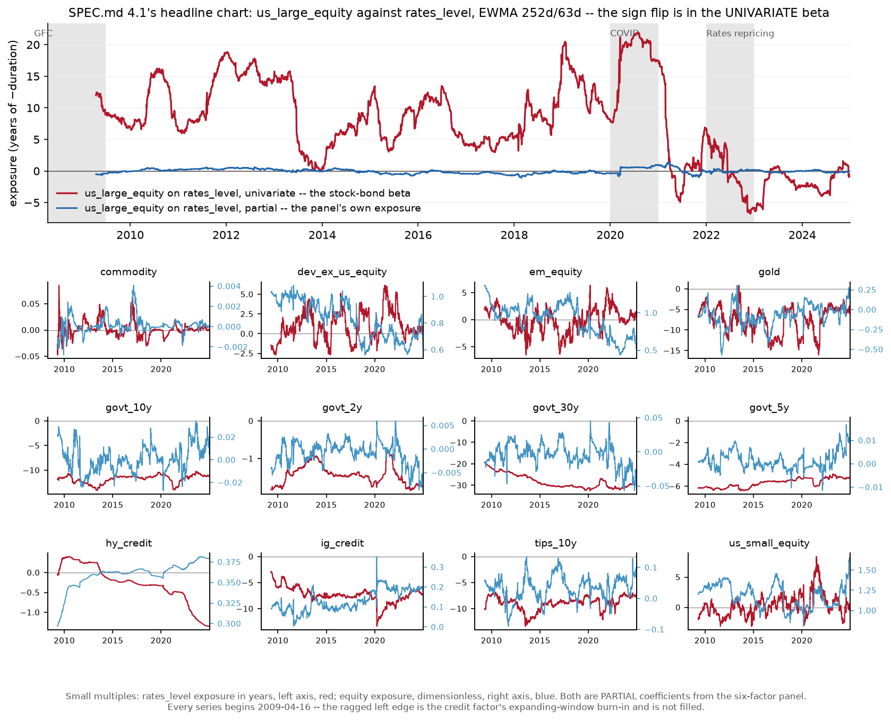

# Model A asset exposures -- rolling betas, R-squared and alpha

SPEC.md 4.1. Generated by `python -m mafrm.factors.exposure_report`; do not edit by hand.

Generated 2026-08-31T04:26:36Z. Exposure window **2008-04-14 .. 2024-12-31**, 13 assets against 6 factors. EWMA-weighted regression over a **252-day window at a 63-day half-life**, matching Barra's BETA descriptor. Nothing here reaches `holdout_start` = 2025-01-01.

## What an exposure is, and what unit it is in

Every regression is run with **both sides in basis points**: the two rate factors arrive that way, and the four return factors and every asset return are multiplied by 1e4 before the regression sees them. That is what makes each coefficient readable without a conversion table.

| Quantity | Unit | How to read it |
|---|---|---|
| `rates_level`, `rates_slope` exposure | years | **minus an effective duration** -- a ten-year zero returns about -10 |
| `equity`, `credit`, `commodity`, `dollar` exposure | dimensionless | an ordinary beta; both sides are in the same units |
| alpha | basis points per day | reported below annualised to %/yr |

A 252-day window at a 63-day half-life is **not 252 observations**. Kish's effective sample size is **160**, and that is the count every standard error and every degrees-of-freedom correction below uses. Using the nominal window would overstate the precision of each alpha by about a quarter.

## The ragged left edge, per factor and per asset

**Not a defect, and not filled.** A six-factor regression needs all six factors. `credit` carries a 252-day expanding-window burn-in against equity and level; after the W2-P2 window-start ruling (SPEC.md 4.1.3) `rates_slope` and `commodity` carry one too. Nothing is forward-filled and the panel is not truncated to the latest start: the dates are stated so that any table spanning them can be read as partial rather than like-for-like.

| Factor | First defined | | Asset | First exposure |
|---|---|---|---|---|
| `equity` | 2007-04-02 | | `commodity` | 2009-04-16 |
| `rates_level` | 2007-04-02 | | `dev_ex_us_equity` | 2009-04-16 |
| `rates_slope` | 2008-04-02 | | `em_equity` | 2009-04-16 |
| `credit` | 2008-04-14 | | `gold` | 2009-04-16 |
| `commodity` | 2008-04-01 | | `govt_10y` | 2009-04-16 |
| `dollar` | 2007-04-02 | | `govt_2y` | 2009-04-16 |
|  |  | | `govt_30y` | 2009-04-16 |
|  |  | | `govt_5y` | 2009-04-16 |
|  |  | | `hy_credit` | 2009-04-16 |
|  |  | | `ig_credit` | 2009-04-16 |
|  |  | | `tips_10y` | 2009-04-16 |
|  |  | | `us_large_equity` | 2009-04-16 |
|  |  | | `us_small_equity` | 2009-04-16 |

Every asset's exposures begin **2009-04-16**, and they begin together because the binding constraint is the factor set rather than any asset's history: the last factor to arrive is `credit` on 2008-04-14, and the 252-day regression window then runs from there. The model window's first year is spent on burn-in and the report says so rather than showing exposures that do not exist.

## Duration recovery -- the session's primary validation

The level factor is normalized to 1bp units (SPEC.md 4.1.1), so an exposure to it reads directly as minus an effective duration. This table asks whether the panel reproduces durations this project already knows **from somewhere the factor set cannot see**.

Two bases, and the distinction matters. `registered` means `experiments.md` rows 64-67, written down on 2026-08-30 before the factor set existed. `identity` means the maturity of a zero-coupon bond, whose duration equals its maturity by definition -- read off `config/universe.yaml`, not a prediction anyone had to make, and therefore not a number that could have been chosen after seeing the answer. The band is the same registered +/-25% in both cases.

| Instrument | Basis | Predicted | Band | **Measured** | Difference | Implied duration | W2-P1 spot check | Univariate, panel dates | Rolling mean | R² | Outcome |
|---|---|---|---|---|---|---|---|---|---|---|---|
| `govt_2y` | registered | -2.00 | [-2.50, -1.50] | **-1.66** (se 0.01) | +0.34 | 1.66y | -1.65 | -1.58 | -1.44 | 0.924 | pass |
| `govt_5y` | identity | -5.00 | [-6.25, -3.75] | **-5.61** (se 0.01) | -0.61 | 5.61y | -- | -5.50 | -5.70 | 0.981 | pass |
| `govt_10y` | registered | -10.00 | [-12.50, -7.50] | **-11.29** (se 0.04) | -1.29 | 11.29y | -11.22 | -11.40 | -11.75 | 0.956 | pass |
| `govt_30y` | identity | -30.00 | [-37.50, -22.50] | **-27.46** (se 0.09) | +2.54 | 27.46y | -- | -29.03 | -28.24 | 0.977 | pass |
| `tlt` | registered | -15.40 | [-19.25, -11.55] | **-15.97** (se 0.12) | -0.57 | 15.97y | -16.26 | -16.83 | -16.96 | 0.865 | pass |
| `hy_credit` | registered | -3.50 | [-4.00, -3.00] | **-0.47** (se 0.02) | +3.03 | 0.47y | +1.49 | +1.43 | -0.28 | 0.993 | **REFUTED** |

**Measured** is the panel's own specification: all six factors, full sample. It is what the band is judged on, and it is the better estimator of the four columns. A univariate regression on level alone omits the slope factor, and a long bond loads on both -- which is why the two univariate columns sit furthest from it at 30 years.

**The two univariate columns are different samples and are kept apart deliberately.** *W2-P1 spot check* is `macro.duration_check` unchanged: level only, on every date the instrument shares with the raw level factor, which runs to 4,435 observations. *Univariate, panel dates* is the same specification restricted to the panel's complete cases, which is ~4,140. Reporting one under the other's name would attribute a change of sample to a change of specification -- a mistake worth a column to avoid. The two instruments W2-P1 never measured show `--`.

**Rolling mean** is the mean of the panel's EWMA exposures, the number the covariance pipeline will actually consume; it agrees with the full-sample figure everywhere, which is the check that the rolling estimator is not drifting somewhere the full-sample one is not.

**5 of 6 land inside the band**, and the 4 synthetic zeros come back at 1.66y, 5.61y, 11.29y, 27.46y against maturities of 2, 5, 10, 30 years -- read in maturity order. The shortfall at the long end is the level PC's own shape rather than an error: its mean loadings run hump-shaped across the curve, low at 2y and 30y and high at 5-10y, so a 30-year zero reads short of thirty years for the same reason a 10-year zero reads long of ten. That shape was measured in W2-P1 and the band was sized for it before any of these numbers existed.

### `hy_credit` is refuted for the second time, and the band is still not widened

HYG's registered prediction was -4.0 to -3.0, the analytical effective duration of a high-yield portfolio. The panel measures **-0.47**. W2-P1 measured +1.49 on a univariate regression and recorded the prediction as refuted; this is the same refutation from a different estimator, and the prediction stays refuted rather than being re-sized to fit.

**What the panel does reproduce is W2-P1's diagnosis, not W2-P1's number, and that was the question.** W2-P1 found HYG's level coefficient moving from +1.49 univariate to -1.36 once equity was controlled for, and read that as the spread channel overwhelming the duration channel: HY spreads tighten when yields rise, so HY's *empirical* rates exposure is small and unstable. The panel's -0.47 is the same story told with all six factors in the regression, and the sign now agrees with the controlled estimate rather than with the raw one.

**And `hy_credit` is a special case that the report must not present as a measurement.** The credit factor *is* HYG excess over cash, orthogonalized against equity and level. Regressing HYG on a factor set built from HYG is close to an identity -- its R-squared is 1.000 -- so its level exposure is the orthogonalization's own hedge coefficient read back, not an independent estimate of high-yield duration. The same is true of `commodity` and DBC. Both are marked in the R-squared table below.

## Per-asset R-squared

SPEC.md 4.1 expects **0.7-0.95** for asset-class-level series and asks that anything below 0.5 be flagged as a candidate for removal from the sleeve or for an additional factor. Flagged here means below 0.5 on at least 50% of the dates it is defined -- `persistence_fraction` in `config/model.yaml`, the same definition the alpha flag uses.

| Asset | Median | Min | Max | Share below 0.5 | Full-sample | Flag |
|---|---|---|---|---|---|---|
| `commodity` *(identity)* | **1.000** | 0.997 | 1.000 | 0% | 0.998 | -- |
| `dev_ex_us_equity` | **0.811** | 0.601 | 0.964 | 0% | 0.831 | -- |
| `em_equity` | **0.696** | 0.448 | 0.923 | 3% | 0.720 | -- |
| `gold` | **0.392** | 0.174 | 0.624 | 86% | 0.273 | **FLAGGED** |
| `govt_10y` | **0.980** | 0.917 | 0.993 | 0% | 0.956 | -- |
| `govt_2y` | **0.956** | 0.811 | 0.985 | 0% | 0.924 | -- |
| `govt_30y` | **0.996** | 0.980 | 0.999 | 0% | 0.977 | -- |
| `govt_5y` | **0.992** | 0.963 | 0.996 | 0% | 0.981 | -- |
| `hy_credit` *(identity)* | **1.000** | 0.997 | 1.000 | 0% | 0.993 | -- |
| `ig_credit` | **0.804** | 0.275 | 0.918 | 10% | 0.513 | -- |
| `tips_10y` | **0.746** | 0.471 | 0.887 | 2% | 0.641 | -- |
| `us_large_equity` | **0.990** | 0.958 | 0.998 | 0% | 0.985 | -- |
| `us_small_equity` | **0.858** | 0.589 | 0.970 | 0% | 0.853 | -- |

*(identity)* marks the `commodity`, `hy_credit` rows, which are **not measurements**. The `credit` factor IS `hy_credit` excess over cash and the `commodity` factor IS `commodity` excess over cash, so those two assets are exact linear combinations of the factor set by construction and their R-squared of 1.000 says nothing about the model's explanatory power. They are shown rather than hidden, and labelled rather than averaged in.

Of the 11 assets that are genuine fits, the 10 unflagged ones have medians between 0.696 (`em_equity`) and 0.996 (`govt_30y`). SPEC.md 4.1 expects 0.7-0.95 for asset-class-level series: every one of them sits at that floor or above it -- `em_equity` is the only one that does not clear it outright, and it misses by 0.004 -- and most exceed the top of the range. The flagged asset is treated separately below rather than averaged into this one. **A six-factor macro model explains asset-class returns very well, and that is the expected result** -- SPEC.md 4.1 says so explicitly, and warns against importing Connor's 10.9% cross-sectional equity figure, which is about a different question.

### `gold` is the one flag, and SPEC.md 4.1 names both remedies

Median R-squared **0.392**, below 0.5 on 86% of dates, with a full-sample fit of 0.273. The frozen universe predicted this in writing: `config/universe.yaml` holds gold separately from broad commodities precisely because "gold's factor loadings are real-rate and dollar rather than growth", and the six-factor set has a nominal rates level, a slope and a dollar but **no real-rate factor**. `tips_10y` is in the universe and a nominal-minus-real breakeven factor is already named as available for free in SPEC.md 3.1.

That makes this a candidate for **an additional factor rather than for removal**, and it is recorded as a candidate and nothing more. Adding a seventh factor to improve one asset's R-squared is a specification change that would owe its own `model-config` row and a reason that is not 'the flag fired'.

## Alpha -- the intercept, reported and not discarded

SPEC.md 4.1's model carries `alpha_i` and `config/model.yaml` fits it. A persistently non-zero intercept means the six factors miss something systematic about that asset, which is exactly what W2-P3's validation and SPEC.md 4.3's hybrid residual-PC model exist to detect -- so it is a deliverable in its own right, not a nuisance term.

Flagged means the within-window t-statistic exceeds 2 in absolute value on at least 50% of dates. The full-sample column is reported beside it with a Newey-West standard error, and it is the more powerful of the two: a within-window test on 160 effective observations has little power against a small persistent drift, and saying so is cheaper than letting a reader assume the rolling test is the stronger one.

### How many flags would chance alone produce?

**Read the flag count against this number, not on its own.** A threshold applied across many series produces flags by chance, and a count without its null expectation beside it is not yet a finding. The exact two-sided normal tail at |t| > 2 is 0.04550 -- not 0.05; the threshold is a rounding of 1.96, and the report uses the exact tail rather than the number it was rounded from.

| Family | Tests | Expected by chance | Observed |
|---|---|---|---|
| **The alpha flag's own family** -- one intercept per investable asset | 13 | **0.59** | **4** |
| The whole exposure panel, if every coefficient were scanned | 78 | 3.55 | not scanned |

The alpha flag runs on the 13 **intercepts** only, so 0.59 is the number that applies to it. The second row is what a reader would need if they went looking across all 13 x 6 exposures, and it is stated so that the two families are not confused with each other.

**Both figures are upper bounds on the true null rate**, because the flag is not a single test. It fires only when |t| exceeds the threshold on a majority of the ~3,895 rolling windows an asset has, and those windows overlap by 251 of their 252 days. A run of that length under the null is far less likely than one draw at 4.6%.

**No multiplicity correction is applied, and that is deliberate.** These flags are diagnostic rather than inferential -- SPEC.md 4.1 asks for a candidate list for a human to look at, not a rejection decision -- and a Bonferroni or FDR adjustment would suppress exactly the marginal cases worth looking at while protecting nothing that gets acted on. What a reader needs is the null expectation printed next to the count, which is this table.

| Asset | Rolling mean (%/yr) | Share with abs(t) > 2 | Full-sample (%/yr) | NW t | Flag |
|---|---|---|---|---|---|
| `commodity` | -0.08 | 3% | **-0.13** | -0.46 | -- |
| `dev_ex_us_equity` | -3.65 | 3% | **-3.79** | -1.97 | -- |
| `em_equity` | -4.88 | 3% | **-6.05** | -1.90 | -- |
| `gold` | +8.93 | 2% | **+9.50** | +2.73 | -- |
| `govt_10y` | +3.66 | 64% | **+3.29** | +5.68 | **FLAGGED** |
| `govt_2y` | +0.61 | 61% | **+0.71** | +6.11 | **FLAGGED** |
| `govt_30y` | +5.29 | 68% | **+4.71** | +4.20 | **FLAGGED** |
| `govt_5y` | +2.02 | 80% | **+2.00** | +11.88 | **FLAGGED** |
| `hy_credit` | +0.08 | 3% | **+0.32** | +1.59 | -- |
| `ig_credit` | +2.89 | 8% | **+1.61** | +1.28 | -- |
| `tips_10y` | +1.26 | 2% | **+0.74** | +0.57 | -- |
| `us_large_equity` | +0.52 | 3% | **+0.10** | +0.22 | -- |
| `us_small_equity` | -5.08 | 2% | **-2.99** | -1.38 | -- |

**Every flagged alpha is a synthetic government zero, and the mechanism is identified rather than left open.** The 4 flags are `govt_2y`, `govt_5y`, `govt_10y`, `govt_30y`, and their full-sample alphas rise monotonically with maturity: +0.71%/yr, +2.00%/yr, +3.29%/yr, +4.71%/yr at 2, 5, 10, 30 years.

**That is a term premium, and the factor set cannot span it by construction.** A constant-maturity zero's total return decomposes exactly into carry + roll-down + duration effect (SPEC.md 3.2). The two rate factors are built from yield *changes*, so they span the duration effect and nothing else; carry and roll-down have nowhere to go but the intercept. Measured directly over the exposure window, carry + roll-down less cash runs +0.63, +1.74, +2.57 and +2.35 %/yr at 2/5/10/30 against measured alphas of +0.71, +2.00, +3.29 and +4.71. Re-running the same regression on the **duration leg alone**, with carry and roll stripped out, collapses the alpha to +0.00, +0.08, +0.20 and -1.69 %/yr. Essentially all of the flagged alpha is carry and roll at 2, 5 and 10 years.

### The 30-year point is an attributed component, not a residual

**An earlier draft of this report called the 30-year zero's -1.69%/yr duration-leg intercept an open residual with convexity as one of two suspects. That was wrong and is corrected here.** Convexity is not a candidate for it, and the discriminator is that convexity is *sign-definite*: for a long bond position it always adds return and never subtracts, so it cannot produce a negative number.

Pushed through, the whole intercept decomposes **exactly and additively**. OLS is linear in the dependent variable, so regressing each leg of SPEC.md 3.2's exact decomposition on the same design gives intercepts that must sum to the intercept of the total. In %/yr:

| n | carry - cash | roll-down | duration | convexity | sum | alpha(excess return) |
|---|---|---|---|---|---|---|
| 2y | +0.38 | +0.31 | +0.00 | +0.01 | **+0.71** | +0.71 |
| 5y | +0.92 | +0.88 | +0.08 | +0.11 | **+2.00** | +2.00 |
| 10y | +1.62 | +1.01 | +0.20 | +0.46 | **+3.29** | +3.29 |
| 30y | +2.31 | +0.20 | **-1.69** | **+3.89** | **+4.71** | +4.71 |

**Convexity is there, it is large, and it is positive** -- +3.89%/yr at 30 years, with **zero negative observations in 4,435** (its smallest value is +5.4e-13). It is `expm1(x) - x` for the log return `x`, which is non-negative for every real `x`, so its sign is guaranteed by construction rather than by this sample.

**It was never in the duration leg to begin with.** `duration_effect` is `(n - d) * [y_t(n - d) - y_{t+1}(n - d)]`, a *log* component and exactly linear in the yield change. A linear function of a yield change carries no second-order term, so the -1.69 could not have been convexity under any sign convention. The decomposition is not mis-signed; the earlier draft attributed the number to the wrong leg.

**What the -1.69 actually is, measured rather than named.** Regress the same duration leg on the four *raw* yield changes instead of on the two rate PCs:

| n | alpha on the 2 rate PCs | R² | alpha on the 4 raw yield changes | R² |
|---|---|---|---|---|
| 2y | +0.00 | 0.9253 | +0.0000 | 1.000000 |
| 5y | +0.08 | 0.9818 | -0.0000 | 1.000000 |
| 10y | +0.21 | 0.9558 | +0.0000 | 1.000000 |
| 30y | **-1.69** | 0.9770 | **-0.0000** | **1.000000** |

The fit on raw yield changes is exact -- R² = 1.000000, intercept -0.0000%/yr, and the coefficient on the 30-year yield change comes back **-29.987** against the -29.996 the formula says it must be. So the -1.69 is **entirely and only the two-PC span limitation**: level and slope span 97.7% of the 30-year yield change's variance, the unspanned 2.3% has a non-zero sample mean because the curve reshaped between 2009 and 2024, and thirty years of duration multiplies it up. It is a named, measurable, attributed component of a two-factor curve model -- the third curve mode -- not something the decomposition failed to explain.

**It is therefore closed as not-a-residual, and the residual stopping rule never applied to it.** Nothing is left open here. If a later session wants the 30-year point's alpha at zero, the change is a third rate factor (curvature), which is a specification decision owing its own `model-config` row -- not a diagnosis.

**No non-government asset carries a flagged alpha**, and that is the result the factor set is being asked for. The largest full-sample intercepts among the ETF sleeve are gold and EM equity, and neither clears the persistence bar.

## Rolling exposures

### The `us_large_equity`-to-rates sign flip is real, and it is **not** in the panel's own exposures

This is the chart SPEC.md 4.1 singles out, and getting it right requires saying which of two different betas it is.

| | 2009-2020 mean | 2021-2024 mean | Share positive, 2009-2020 | Share positive, 2021-2024 |
|---|---|---|---|---|
| **Univariate** (level only) | +10.19 | -0.20 | 100% | 39% |
| Partial (all six factors) | -0.03 | -0.00 | 46% | 42% |

**The panel's own exposure shows nothing, and the reason is mechanical rather than interesting.** The panel reports *partial* coefficients -- what is left of an asset's sensitivity to one factor with the other five held fixed. `us_large_equity` is SPY and the equity factor is Ken French `Mkt-RF`; W1-P5 measured those two at 0.9786 correlation. The equity factor therefore absorbs essentially all of SPY's variance (its R-squared is 0.990), and what remains to load on rates is approximately zero on every date of the sample. A partial coefficient cannot show a stock-bond regime change when equity-as-an-asset-class is one of the regressors.

**The univariate beta shows it unambiguously.** Calendar-year means, in years of minus-effective-duration:

| Year | 2009 | 2010 | 2011 | 2012 | 2013 | 2014 | 2015 | 2016 | 2017 | 2018 | 2019 | 2020 | 2021 | 2022 | 2023 | 2024 |
|---|---|---|---|---|---|---|---|---|---|---|---|---|---|---|---|---|
| Beta | +9.0 | +11.3 | +10.7 | +15.8 | +7.6 | +6.1 | +7.5 | +9.5 | +4.5 | +8.8 | +13.2 | +17.9 | +2.8 | -0.1 | -1.8 | -1.6 |

It runs **+17.9 in 2020** and **-0.1 in 2022**, crossing through zero during 2021, and it never returns. Read as a duration, SPY behaved like a bond with **-17.9 years** of duration through the 2010s -- rising when yields rose, because yields rose in risk-on conditions -- and like an instrument with approximately zero to slightly positive duration afterwards, once inflation rather than growth became what moved the curve. That is the stock-bond correlation regime change, measured on this project's own factor rather than quoted.

**Both lines are drawn in the figure**, because the gap between them is the point: it is a worked example of what a factor model's exposures do and do not tell you, and of why a risk model's partial coefficient is not the correlation a reader has in mind.

## Open, and owed to a later session

1. **`gold` is a candidate for a real-rate or breakeven factor**, not for removal. The seventh factor is a specification change and owes its own `model-config` row.
2. **Nothing, where the 30-year zero used to be.** Its -1.69%/yr duration-leg alpha is closed as an attributed component -- the two-PC span limitation -- and is listed here only so a reader coming from an earlier version of this report does not go looking for an open item that no longer exists. A third rate factor would remove it; that is a specification choice, not an outstanding diagnosis.
3. **`hy_credit` and `commodity` are identities, not fits.** Nothing downstream should read their R-squared or their exposures as evidence about the model. The cleanest fix is a factor built from an index rather than from a sleeve member, which is a universe question and not a W2 one.
4. **These exposures are static inputs to weeks 3-4, not forecasts.** Nothing here has been validated out of sample; that is what the bias statistics of SPEC.md 6.1 are for.

