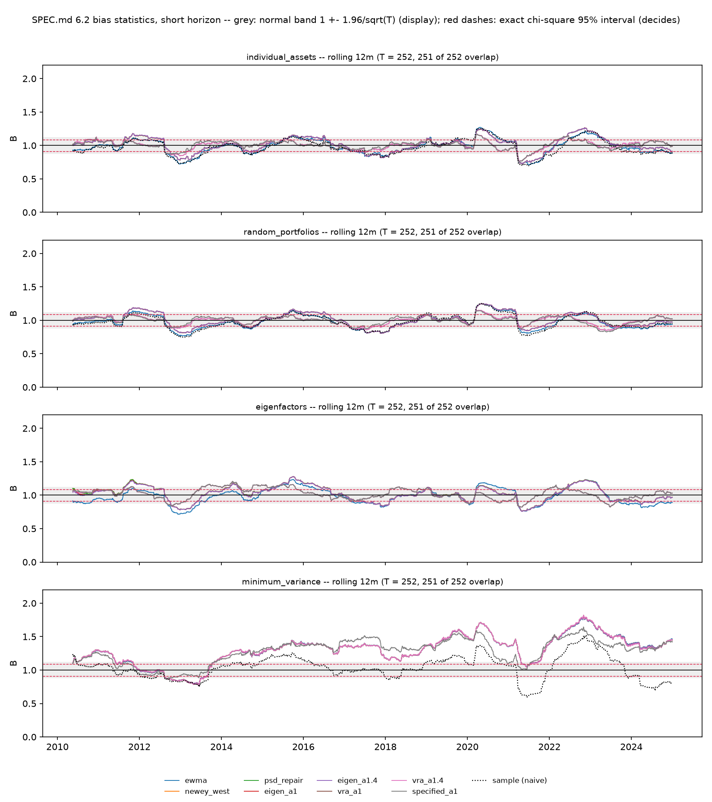

# Bias statistics: the test that matters is family 4

Generated by `python -m mafrm.factors.bias_report`. SPEC.md 6.1 and 6.2, W4-P2.

SPEC.md 6.2 states the claim this whole report exists to test: *"validating only on random or benchmark portfolios will tell you your model is fine when it is not"*. The test is families 2 and 4 evaluated on the **same covariance matrix** -- random dollar-neutral portfolios whose weights cannot see the estimation error, against minimum-variance portfolios whose weights are a function of it.

## What was scored

- Panel: Model A's residual panel, **3,889 dates**, 2009-04-16 to 2024-12-31, N = 13 assets and K = 6 factors. Everything ends strictly before `sample.holdout_start` = 2025-01-01.
- scored window: 3,874 of 3,882 forecast dates, 2009-05-07 to 2024-12-31; dropped 7 before the last PSD-repair firing, 0 where T <= N = 13 left the naive comparand singular, and 1 with no SPEC.md 5.4 multiplier yet
- Families: 13 individual assets (two excluded from the aggregate, below), 100 random dollar-neutral portfolios redrawn each date, 6 factor eigen-portfolios ranked by eigenvalue, and one minimum-variance fully-invested portfolio rebuilt each date.
- **Family 4's alpha-constrained sibling is not here.** SPEC.md 6.2 also names minimum variance subject to `alpha'w = 1`; SPEC.md 6.2.1 defers it to W6 because `alpha` is unspecified and with `alpha = 1` it degenerates to the fully-invested portfolio already reported.

## The headline

`B > 1` is under-forecasting. The column that matters is **gap 4 - 2**: family 2 is the control that should sit near 1 for every estimator, so whatever family 4 does above it is the risk model failing on the portfolios an optimizer actually picks.

| Horizon | Variant | family 1 median `B` | family 2 median `B` | family 3 median `B` | family 4 `B` | **gap 4 - 2** | MRAD (family 1) |
|---|---|---|---|---|---|---|---|
| short | `sample` | 0.9858 | 0.9811 | n/a | **1.0660** | **+0.0850** | 0.0199 |
| short | `ewma` | 0.9850 | 0.9826 | 0.9915 | **1.3319** | **+0.3493** | 0.0320 |
| short | `newey_west` | 1.0258 | 1.0106 | 1.0464 | **1.3322** | **+0.3216** | 0.0350 |
| short | `psd_repair` | 1.0258 | 1.0106 | 1.0464 | **1.3322** | **+0.3216** | 0.0350 |
| short | `eigen_a1` | 1.0245 | 1.0101 | 1.0415 | **1.3321** | **+0.3220** | 0.0339 |
| short | `eigen_a1.4` | 1.0239 | 1.0099 | 1.0388 | **1.3322** | **+0.3222** | 0.0334 |
| short | `vra_a1` | 1.0201 | 1.0014 | 1.0414 | **1.3328** | **+0.3313** | 0.0306 |
| short | `vra_a1.4` | 1.0198 | 1.0015 | 1.0389 | **1.3329** | **+0.3314** | 0.0303 |
| short | `specified_a1` | 1.0175 | 1.0009 | 1.0414 | **1.3010** | **+0.3001** | 0.0292 |
| long | `sample` | 0.9679 | 0.9568 | n/a | **1.0425** | **+0.0857** | 0.0401 |
| long | `ewma` | 0.9756 | 0.9675 | 0.9736 | **1.3127** | **+0.3452** | 0.0392 |
| long | `newey_west` | 1.0132 | 0.9990 | 1.0358 | **1.3136** | **+0.3146** | 0.0305 |
| long | `psd_repair` | 1.0132 | 0.9990 | 1.0358 | **1.3136** | **+0.3146** | 0.0305 |
| long | `eigen_a1` | 1.0127 | 0.9987 | 1.0266 | **1.3135** | **+0.3148** | 0.0294 |
| long | `eigen_a1.4` | 1.0126 | 0.9985 | 1.0235 | **1.3135** | **+0.3150** | 0.0290 |
| long | `vra_a1` | 1.0091 | 0.9910 | 1.0223 | **1.3167** | **+0.3257** | 0.0292 |
| long | `vra_a1.4` | 1.0088 | 0.9912 | 1.0200 | **1.3168** | **+0.3256** | 0.0288 |
| long | `specified_a1` | 1.0071 | 0.9918 | 1.0223 | **1.2883** | **+0.2965** | 0.0282 |

Full-sample interval, T = 3,874: chi-square 0.9777-1.0223 (**exact, and the one that decides**), normal band 0.9685-1.0315 (display convention).

### SPEC.md 6.4: the Shepard-corrected forecast beside the raw one

`[1 - p/T_eff]^-2` multiplies a VARIANCE; the volatility multiplier is its square root, and the corrected `B` is the raw `B` divided by the volatility multiplier -- the part of family 4's excess that Shepard's sampling-error argument can account for. For the `sample` variant the closed form applies exactly (one window, whole covariance). For every factor variant it is an **upper bound** on the estimation-error correction: `rho` is estimated on a window six times longer than `sigma` and SPEC.md 5.3 has already corrected its leg, so applying Eq. 32 at the volatility window on top would double-count (SPEC.md 5.4.2). The measured split-window figure and the three-way accounting are in `reports/second_order_risk.md`. What the corrected `B` shows is the finding of SPEC.md 6.2.6 from the other side: the factor variants' family-4 `B` barely moves, because the excess was never sampling error.

| Horizon | Variant | closed form | `p/T_eff` | multiplier (variance) | multiplier (volatility) | family 4 forecast, median bps/day: raw | corrected | family 4 `B`: raw | corrected |
|---|---|---|---|---|---|---|---|---|---|
| short | `sample` | Eq. 13, `N = 13`, exact for a single-window covariance | 0.0536 | 1.1166 | 1.0567 | 2.582 | **2.729** | 1.0660 | **1.0089** |
| short | `ewma` | Eq. 32, `K = 6`, whole-covariance UPPER BOUND for a split-window estimator | 0.0248 | 1.0514 | 1.0254 | 2.400 | **2.461** | 1.3319 | **1.2989** |
| short | `newey_west` | Eq. 32, `K = 6`, whole-covariance UPPER BOUND for a split-window estimator | 0.0248 | 1.0514 | 1.0254 | 2.391 | **2.452** | 1.3322 | **1.2992** |
| short | `psd_repair` | Eq. 32, `K = 6`, whole-covariance UPPER BOUND for a split-window estimator | 0.0248 | 1.0514 | 1.0254 | 2.391 | **2.452** | 1.3322 | **1.2992** |
| short | `eigen_a1` | Eq. 32, `K = 6`, whole-covariance UPPER BOUND for a split-window estimator | 0.0248 | 1.0514 | 1.0254 | 2.392 | **2.453** | 1.3321 | **1.2991** |
| short | `eigen_a1.4` | Eq. 32, `K = 6`, whole-covariance UPPER BOUND for a split-window estimator | 0.0248 | 1.0514 | 1.0254 | 2.392 | **2.453** | 1.3322 | **1.2992** |
| short | `vra_a1` | Eq. 32, `K = 6`, whole-covariance UPPER BOUND for a split-window estimator | 0.0248 | 1.0514 | 1.0254 | 2.379 | **2.440** | 1.3328 | **1.2998** |
| short | `vra_a1.4` | Eq. 32, `K = 6`, whole-covariance UPPER BOUND for a split-window estimator | 0.0248 | 1.0514 | 1.0254 | 2.379 | **2.440** | 1.3329 | **1.2999** |
| short | `specified_a1` | Eq. 32, `K = 6`, whole-covariance UPPER BOUND for a split-window estimator | 0.0248 | 1.0514 | 1.0254 | 2.308 | **2.367** | 1.3010 | **1.2688** |
| long | `sample` | Eq. 13, `N = 13`, exact for a single-window covariance | 0.0179 | 1.0367 | 1.0182 | 2.964 | **3.018** | 1.0425 | **1.0239** |
| long | `ewma` | Eq. 32, `K = 6`, whole-covariance UPPER BOUND for a split-window estimator | 0.0083 | 1.0167 | 1.0083 | 2.400 | **2.420** | 1.3127 | **1.3019** |
| long | `newey_west` | Eq. 32, `K = 6`, whole-covariance UPPER BOUND for a split-window estimator | 0.0083 | 1.0167 | 1.0083 | 2.388 | **2.408** | 1.3136 | **1.3027** |
| long | `psd_repair` | Eq. 32, `K = 6`, whole-covariance UPPER BOUND for a split-window estimator | 0.0083 | 1.0167 | 1.0083 | 2.388 | **2.408** | 1.3136 | **1.3027** |
| long | `eigen_a1` | Eq. 32, `K = 6`, whole-covariance UPPER BOUND for a split-window estimator | 0.0083 | 1.0167 | 1.0083 | 2.389 | **2.409** | 1.3135 | **1.3026** |
| long | `eigen_a1.4` | Eq. 32, `K = 6`, whole-covariance UPPER BOUND for a split-window estimator | 0.0083 | 1.0167 | 1.0083 | 2.389 | **2.409** | 1.3135 | **1.3027** |
| long | `vra_a1` | Eq. 32, `K = 6`, whole-covariance UPPER BOUND for a split-window estimator | 0.0083 | 1.0167 | 1.0083 | 2.383 | **2.403** | 1.3167 | **1.3058** |
| long | `vra_a1.4` | Eq. 32, `K = 6`, whole-covariance UPPER BOUND for a split-window estimator | 0.0083 | 1.0167 | 1.0083 | 2.383 | **2.403** | 1.3168 | **1.3059** |
| long | `specified_a1` | Eq. 32, `K = 6`, whole-covariance UPPER BOUND for a split-window estimator | 0.0083 | 1.0167 | 1.0083 | 2.400 | **2.420** | 1.2883 | **1.2776** |

### What the battery found, in four lines

1. **H1 HOLDS.** Family 2 runs 0.9568-1.0106 across every variant and both horizons, the naive sample covariance included. Random portfolios say all nine of these models are fine.
2. **H2 HOLDS**, mid-range rather than at the low end. Family 4 is **1.3321** short against a registered 1.2-1.5, and **the gap between families 2 and 4 on the same covariance matrix is +0.3220**. That number is the risk-model term of SPEC.md 1's identity, measured.
3. **H3's first half is REFUTED.** SPEC.md 5.3's eigenfactor adjustment closes **none** of that gap -- family 4 moves -0.0001 at `a = 1` and +0.0000 at `a = 1.4`. Its second half holds: family 2 moves by less than 0.0005. **The stage is not broken** -- family 3, the eigen-portfolios it is actually about, moves the right way.
4. **Control C1 says why, and it was pre-registered.** The gap is SPEC.md 5.5's **diagonal** specific-risk assumption, not factor-covariance estimation error. Restoring the residual correlations off-diagonal only takes family 4 to **1.0481**, 107% of the gap to the naive comparand, while family 2 moves 0.002. SPEC.md 5.3 corrects the factor covariance, and at `K/T_eff = 0.0248` there is barely any of that bias to correct. **That is a statement about `K/T`, and W7 is where the technique is tested.**

## The reframing: this is SPECIFICATION error, not estimation error

**This is the finding, and it changes what the risk-model term of SPEC.md 1's identity is made of.** `K/T`, Shepard's second-order correction and SPEC.md 5.3's eigenfactor adjustment all describe **estimation error** -- the covariance matrix is right in form and wrong in its numbers because it was fitted on a finite sample. What this panel has instead is **specification error**: the false diagonal in `Sigma = X F X' + Delta`. The matrix is wrong in its form, and no amount of data fixes a form.

**Two independent measurements say so, and they were taken different ways.**

- **C1, empirically.** 107% of the family-4 gap is attributable to the residual correlations, against family 2 moving 0.002. The effect is direction-selective, which is what the second registered falsifier established.
- **Shepard, arithmetically.** At `K/T_eff = 0.0248` the closed form puts the understatement at **5.1% in variance** (the figure SPEC.md 6.4's table quotes) against an **observed 32%**. So sampling error accounts for **at most a sixth of the gap even in principle** -- and that is the generous reading: taking `[1 - K/T_eff]^-2` as the variance multiplier SPEC.md 6.4's Eq. 32 writes puts it at 2.5% on volatility and the share at a thirteenth. At the long horizon `K/T_eff` is 0.0083 and the share is smaller again.

**That is why the eigenfactor adjustment closes none of the gap, and why H3's first half being refuted is not a disappointment.** It is the same measurement seen from the other side. A stage that corrects estimation error cannot move a bias that is not estimation error, and both C1 and Shepard say this one is not.

**Stated as the general finding: at small `K` the industry-standard corrections address a term that is negligible, while the term that actually matters is one the model assumes away.** That belongs beside the five published techniques this project has already measured out of regime -- Marchenko-Pastur denoising, SPEC.md 5.5(c)'s blend, SPEC.md 5.5(d) at two-member buckets, the Bartlett fallback firing at `K = 3`, and now SPEC.md 5.3 at `K/T_eff` of a few hundredths. It is the sixth, and it is the one with the largest consequence, because it is about the technique the project was built around.

**It also explains the naive sample covariance winning at `N = 13`.** It imposes no diagonal assumption, so it has none to be wrong about. Its advantage is the absence of a misspecification rather than better estimation -- it estimates 91 free covariance parameters where the factor model estimates 21 in `F` and 13 in `Delta`, so it is the noisier of the two, and C1 is what separates the two explanations: give the factor model the residual correlations and it matches the naive comparand at the short horizon and beats it at the long one. SPEC.md 15.2's table is why the naive advantage does not survive the equity module: at `N = 500` and `T_eff = 727` the same estimator sits at `N/T = 0.688` and `[1 - N/T]^-2 = 10.25`, effectively singular, where estimation error is the whole story.

**Why the diagonal is not repaired, since a reader will ask.** Repairing it would mean not implementing the specified model, and **the specification's failure is the deliverable**. That is W4-P1's ruling holding rather than a new one: SPEC.md 5.5.1 settled five undefined terms on structural arguments with the alternatives deliberately not built, SPEC.md 5.5.5 kept stage (d) after proving it data-independent at two-member buckets, and in every case the alternative -- drop the stage because it does nothing here -- was declined. A project that repairs each published technique wherever this panel embarrasses it ends up reporting a model nobody specified, and can no longer say which published method failed where. C1 is a control and not a candidate; SPEC.md 5.5 still specifies a diagonal; `config/model.yaml` is untouched by it.

## Which number is the headline, and why it is the pre-VRA one

**The headline is `eigen_*`, not `specified_*`.** SPEC.md 5.4 sets `lambda_F^2 = sum_t w_t (B_t^F)^2` -- the volatility regime adjustment is calibrated on realised data precisely to drive the bias statistic to one. A post-VRA `B` near 1 is therefore substantially what that stage was built to produce, not evidence that the risk model is calibrated. It is not perfectly circular: `lambda_F^2` is a lagged EWMA, so the out-of-sample `B` is not identically one. It is close enough that the project's central claim cannot rest on it.

So the two answer different questions. **Pre-VRA `B` measures whether the risk model understates risk**, which is the project's thesis and the `(1 - 1/B)` term of SPEC.md 1's identity. **Post-VRA `B` measures whether the regime adjustment generalises out of sample**, which is a different and lesser question.

W4-P1 made the same point about the specific leg from the other side: the specific VRA absorbs 82-90% of SPEC.md 5.5(a)'s Newey-West correction and reverses the sign of `lambda_S`. Both legs of `specified_*` are therefore close to circular, and that is why it is reported last rather than first.

## The rolling chart

One panel per family, one line per covariance variant, rolling window **12 months = 252 trading days** stepped one day.

> **CLAUDE.md failure mode 9.** Consecutive readings share **251 of 252** observations. The series is enormously autocorrelated and the number of readings is not an `n`. Every interval on the chart is computed at `T = 252` -- the observations *inside one window* -- and never at the number of windows.

Band at the chart's own window, T = 252: chi-square 0.9125-1.0874 (**exact, and the one that decides**), normal band 0.8765-1.1235 (display convention).

**A single rolling reading of 1.4 is not evidence of miscalibration.** SPEC.md 6.1 says so and the arithmetic says why: at `T = 12` monthly observations the normal band is +-0.57 and the exact interval is 0.59-1.41. Only a persistent level shift is evidence. **The claim survives under both intervals and the margin does not**: 1.4 sits comfortably inside the normal band and a hair inside the exact one, and a reading of 1.45 would be inside the band and outside the exact interval. That is why the exact interval is the one every claim here rests on -- the normal band's constant is arguable (the sampling standard deviation of a standard deviation is `sigma/sqrt(2(T-1))`, so a `sqrt(2T)` denominator is equally defensible), while `(T-1)B^2 ~ chi^2_{T-1}` under the null is not.

## Daily and monthly, and why daily is primary

Daily is the primary frequency and it is where the power is: the scored window gives `T = 3,874` daily observations against `T = 188` monthly ones, and a 12-observation window cannot separate `B = 1.0` from `B = 1.5` at all. The monthly leg is reported alongside because it is what MSCI plots and because a monthly-horizon user is a real consumer of this model.

The monthly construction: portfolio weights are fixed on the first scored date of each month and held, `R_m` is the sum of that portfolio's daily returns, and `sigma_m` is the forecast standing when the month opened scaled by the square root of the month's own number of scored dates. Weights are **not** rebuilt inside a month -- a month's return is only the return of a portfolio if the portfolio existed for the whole month.

| Horizon | Variant | family 2 `B` daily | family 2 `B` monthly | family 4 `B` daily | family 4 `B` monthly |
|---|---|---|---|---|---|
| short | `sample` | 0.9811 | 0.9192 | 1.0660 | 1.2793 |
| short | `ewma` | 0.9826 | 0.9240 | 1.3319 | 1.6424 |
| short | `newey_west` | 1.0106 | 0.9434 | 1.3322 | 1.6417 |
| short | `psd_repair` | 1.0106 | 0.9434 | 1.3322 | 1.6417 |
| short | `eigen_a1` | 1.0101 | 0.9429 | 1.3321 | 1.6450 |
| short | `eigen_a1.4` | 1.0099 | 0.9427 | 1.3322 | 1.6457 |
| short | `vra_a1` | 1.0014 | 0.9476 | 1.3328 | 1.6484 |
| short | `vra_a1.4` | 1.0015 | 0.9478 | 1.3329 | 1.6488 |
| short | `specified_a1` | 1.0009 | 0.9501 | 1.3010 | 1.6417 |
| long | `sample` | 0.9568 | 0.8853 | 1.0425 | 1.2600 |
| long | `ewma` | 0.9675 | 0.8966 | 1.3127 | 1.5831 |
| long | `newey_west` | 0.9990 | 0.9237 | 1.3136 | 1.5808 |
| long | `psd_repair` | 0.9990 | 0.9237 | 1.3136 | 1.5808 |
| long | `eigen_a1` | 0.9987 | 0.9231 | 1.3135 | 1.5843 |
| long | `eigen_a1.4` | 0.9985 | 0.9228 | 1.3135 | 1.5850 |
| long | `vra_a1` | 0.9910 | 0.9282 | 1.3167 | 1.5886 |
| long | `vra_a1.4` | 0.9912 | 0.9282 | 1.3168 | 1.5891 |
| long | `specified_a1` | 0.9918 | 0.9359 | 1.2883 | 1.5759 |

Monthly interval, T = 188: chi-square 0.8987-1.1012 (**exact, and the one that decides**), normal band 0.8571-1.1429 (display convention).

## Stage attribution -- what each published correction did to `B`

**`B` is reported for the pipeline as specified, and alongside it what each stage contributed.** This is attribution and not selection: the pipeline stays exactly as SPEC.md 5 specifies, nothing is chosen on the basis of what `B` comes out as, and the sign of every stage's effect was put on file before any bias statistic existed.

The reason it is needed: W3-P2 measured SPEC.md 5.2's Newey-West correction as **net negative** on this panel -- median volatility ratio 0.9653 short and 0.9828 long, with `rates_slope` down to 0.79. A lower forecast raises `B`. So stage 2 pushes the bias statistic toward the project's own headline claim that risk models understate risk, by roughly 30x more than W3-P1's zero-mean convention pushes it the other way. That is not a defect -- it is published methodology applied as specified -- but it means a raw `B` of 1.15 cannot be read as "the risk model understates by 15%" without knowing how much of it is a 3.5% volatility haircut from a correction that happened to point that way.

W3-P4 measured the other side. `lambda_F` is 1.0162 short and **0.9204 long**: the long-horizon model over-forecasts by 8%, which is what a 252-day volatility half-life does to a panel containing 2008 and 2020 -- slow to come down after a crisis, carrying crisis variance through the calm that follows. On the long horizon the VRA therefore scales the forecast **down** by 8% and Newey-West already scaled it down by 1.7%, so roughly **10% of downward forecast pressure sits in the pipeline before any realised return is read**, all of it pushing `B` up toward the project's own claim.

### `short` horizon

| Stage added | family 4 `B` | change | family 2 `B` | change | clip bound (family 4) |
|---|---|---|---|---|---|
| naive asset-level EWMA sample covariance (no factor structure) | 1.0660 | -- | 0.9811 | -- | 0.9809% |
| SPEC.md 5.1 only -- separated EWMA, moments about zero | 1.3319 | -- | 0.9826 | -- | 1.8327% |
| + SPEC.md 5.2 Newey-West | 1.3322 | +0.0003 | 1.0106 | +0.0280 | 1.8069% |
| + SPEC.md 5.2 PSD repair (the pre-eigenfactor forecast) | 1.3322 | +0.0000 | 1.0106 | +0.0000 | 1.8069% |
| + SPEC.md 5.3 eigenfactor, a = 1 (attribution-facing, USE4 production) | 1.3321 | -0.0001 | 1.0101 | -0.0005 | 1.8069% |
| + SPEC.md 5.3 eigenfactor, a = 1.4 (optimizer-facing) | 1.3322 | +0.0000 | 1.0099 | -0.0002 | 1.8069% |
| + SPEC.md 5.4 factor VRA, a = 1 | 1.3328 | +0.0006 | 1.0014 | -0.0085 | 1.7811% |
| + SPEC.md 5.4 factor VRA, a = 1.4 | 1.3329 | +0.0001 | 1.0015 | +0.0000 | 1.7811% |
| + SPEC.md 5.4 SPECIFIC VRA, a = 1 -- the pipeline exactly as specified | 1.3010 | -0.0319 | 1.0009 | -0.0006 | 1.4972% |

`lambda_F` (lagged, at the last scored date) `a = 1`: 1.0191, `a = 1.4`: 1.0190; `lambda_S`: 1.1464.

### `long` horizon

| Stage added | family 4 `B` | change | family 2 `B` | change | clip bound (family 4) |
|---|---|---|---|---|---|
| naive asset-level EWMA sample covariance (no factor structure) | 1.0425 | -- | 0.9568 | -- | 0.9293% |
| SPEC.md 5.1 only -- separated EWMA, moments about zero | 1.3127 | -- | 0.9675 | -- | 1.9876% |
| + SPEC.md 5.2 Newey-West | 1.3136 | +0.0009 | 0.9990 | +0.0315 | 2.0134% |
| + SPEC.md 5.2 PSD repair (the pre-eigenfactor forecast) | 1.3136 | +0.0000 | 0.9990 | +0.0000 | 2.0134% |
| + SPEC.md 5.3 eigenfactor, a = 1 (attribution-facing, USE4 production) | 1.3135 | -0.0001 | 0.9987 | -0.0003 | 2.0134% |
| + SPEC.md 5.3 eigenfactor, a = 1.4 (optimizer-facing) | 1.3135 | +0.0000 | 0.9985 | -0.0002 | 2.0134% |
| + SPEC.md 5.4 factor VRA, a = 1 | 1.3167 | +0.0032 | 0.9910 | -0.0075 | 2.0134% |
| + SPEC.md 5.4 factor VRA, a = 1.4 | 1.3168 | +0.0000 | 0.9912 | +0.0001 | 2.0134% |
| + SPEC.md 5.4 SPECIFIC VRA, a = 1 -- the pipeline exactly as specified | 1.2883 | -0.0285 | 0.9918 | +0.0006 | 1.6262% |

`lambda_F` (lagged, at the last scored date) `a = 1`: 0.9210, `a = 1.4`: 0.9210; `lambda_S`: 1.0101.

## The identity assets, and what is excluded from what

`commodity` and `hy_credit` regress against the macro factor set at `R^2 = 1.000` because the proxy **is** the factor (SPEC.md 4.1.1). Their `b_nt` is pinned at a ratio that cannot understate anything, so averaging them into a 13-asset family-1 aggregate pulls it toward 1 by roughly 2/13 of the distance between the true mean bias and unity.

**They are excluded from family 1's aggregate and from nothing else.** They remain in the asset covariance, so every family-2 and family-4 portfolio still holds them; they are reported individually below; and, per the W4-P1b amendment, they are also out of SPEC.md 5.5(d)'s shrinkage target and the specific VRA's cross-section. Removing them from the model would change the model -- the constraint is about aggregation.

| Asset | `B` (`eigen_a1`, short) | in family-1 aggregate |
|---|---|---|
| `commodity` | excluded -- identity asset | **no** |
| `dev_ex_us_equity` | 0.9592 | yes |
| `em_equity` | 0.9635 | yes |
| `gold` | 1.0505 | yes |
| `govt_10y` | 1.0236 | yes |
| `govt_2y` | 1.0535 | yes |
| `govt_30y` | 0.9954 | yes |
| `govt_5y` | 1.0501 | yes |
| `hy_credit` | excluded -- identity asset | **no** |
| `ig_credit` | 1.0507 | yes |
| `tips_10y` | 1.0245 | yes |
| `us_large_equity` | 1.0105 | yes |
| `us_small_equity` | 1.0271 | yes |

## `K/T_eff` across the scored window

SPEC.md 5.1.2's diagnostic, carried rather than used as a filter. The burn-in criterion above removes only dates where an estimator has *no* answer; the early scored dates are estimated at a `K/T_eff` that makes them poor, and they are labelled rather than suppressed.

| Horizon | first scored date | `K/T_eff` there | median | last | `K/T_eff` there |
|---|---|---|---|---|---|
| short | 2009-05-07 | 0.4005 | 0.0248 | 2024-12-31 | 0.0248 |
| long | 2009-05-07 | 0.4001 | 0.0083 | 2024-12-31 | 0.0083 |

## Control C1: is family 4's bias the DIAGONAL specific-risk assumption?

Pre-registered in `experiments.md` rows 162-163, with both falsifiers written before the measurement existed. **The suspect:** the naive sample covariance beats the factor model on family 4, which is the opposite of the direction SPEC.md 6.4's argument for factor structure predicts, and the candidate mechanism is that `Sigma = X F X' + diag(delta^2)` throws away every residual correlation. W4-P1 measured all 78 residual pairs and found `SPY/IWM` at **-0.5488**, confirming SPEC.md 5.5's own closing prediction with the opposite sign. A diagonal `Delta` understates the variance of long-short residual combinations, and `w = Sigma^-1 1` loads hardest on exactly the directions the model calls lowest-variance.

**The test changes the off-diagonal and nothing else**: `diag(delta^2)` becomes `D_delta R_u D_delta` with `R_u` the EWMA residual correlation at the specific-risk half-life and `D_delta` SPEC.md 5.5's own shrunk deviations, unchanged to the last bit. Anything that moved the diagonal too would confound *the residuals are correlated* with *the specific volatilities are wrong*.

| Horizon | family 4 `B` diagonal | family 4 `B` correlated | moved toward 1 | family 2 `B` diagonal | family 2 `B` correlated | naive `B` | gap closed | verdict |
|---|---|---|---|---|---|---|---|---|
| short | 1.3321 | **1.0481** | +0.2840 | 1.0101 | 1.0122 | 1.0660 | 106.8% | **HOLDS** |
| long | 1.3135 | **1.0237** | +0.2897 | 0.9987 | 1.0007 | 1.0425 | 106.9% | **HOLDS** |

Falsifier 1: family 4 moves toward 1 by less than the exact interval's half-width at the scored `T` (0.0223). Falsifier 2: family 2 moves by more than the same half-width, which would make the reading about the level of the forecast rather than about its direction-selectivity.

| Horizon | realised min-var vol, naive | diagonal | correlated |
|---|---|---|---|
| short | 4.570 | 5.196 | 4.679 |
| long | 4.688 | 5.157 | 4.632 |

**What C1 is not.** It is not a candidate. SPEC.md 5.5 specifies a diagonal `Delta`, USE4 does, and SPEC.md 15.2's `N ~ 500` equity module makes a full residual covariance from `T_eff = 727` precisely the singular regime SPEC.md 15.2 uses to argue that a sample covariance is not a thing that works. The production path is unchanged. The row is counted `model-config` anyway, on row 137's test and W3-P2's precedent -- the argument for lowering it is at the row and is declined there.

## Realised volatility of the minimum-variance portfolio

SPEC.md 6.5's headline model-comparison metric, and Menchero & Ji's methodological argument for it: do **not** compare risk models by realised information ratio, it is far too noisy. Compare by the realised volatility of the minimum-variance portfolios built from each. Lower is better, and unlike `B` this number cannot be moved by rescaling the matrix -- a pure level correction changes no min-var weight at all.

| Horizon | `sample` | `ewma` | `newey_west` | `psd_repair` | `eigen_a1` | `eigen_a1.4` | `vra_a1` | `vra_a1.4` | `specified_a1` |
|---|---|---|---|---|---|---|---|---|---|
| short | 4.570 | 5.221 | 5.204 | 5.204 | 5.196 | 5.193 | 5.208 | 5.206 | 5.161 |
| long | 4.688 | 5.180 | 5.165 | 5.165 | 5.157 | 5.155 | 5.199 | 5.198 | 5.139 |

Basis points per day, realised standard deviation over the scored window.

