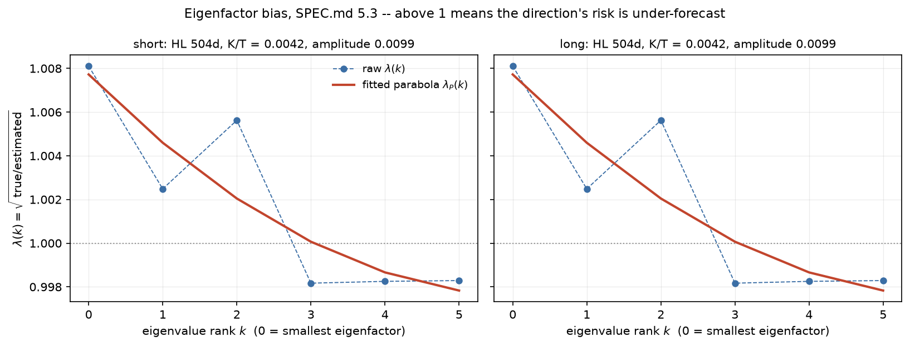

# The eigenfactor risk adjustment on this panel

Generated 2026-08-31 by `python -m mafrm.factors.eigenfactor_report`. SPEC.md 5.3,
5.3.1 and 5.3.2. Menchero, Wang & Orr (2011).

Sampling error in a factor covariance matrix is not neutral: diagonalise it and the
small eigenvalues are biased **down**, the large ones slightly **up**. An optimizer
seeking minimum risk loads onto exactly the low-variance directions, so it loads onto
the most under-forecast ones. This stage measures that bias by Monte Carlo, direction
by direction, and rescales the eigenvalues by what it finds.

Panel: **6 orthogonalized macro factors**, 4,146 dates, 2008-04-14 to 2024-12-31 -- strictly before `sample.holdout_start` = 2025-01-01. `M = 2,000` Monte Carlo trials from `model.seed`.

## The one implementation decision, and the test that settles it

**The adjustment runs in correlation space and is rescaled by `sigma` afterwards.**
SPEC.md 5.3 step 1 diagonalises `F`; in USE4 every factor is already in return units,
so a diagonal rescaling across factors cannot happen there and the question never
arises. This panel deliberately mixes decimal returns with basis points of yield
(SPEC.md 4.1.1, for the effective-duration reading), and `experiments.md` row 96
measures what that costs: `cond(F) = 9.96e6` against `cond(rho) = 3.27`, essentially
all of it a 7.3e6 variance ratio across mixed-unit columns. Diagonalising `F` here
would let the numeraire decide which direction is the smallest eigenfactor -- the one
the correction acts on hardest -- before the data does.

SPEC.md 5.3.2's tiebreak, fixed in writing before either candidate was built: prefer
the resolution that keeps units bookkeeping in **fewer places**. Correlation space
puts it in one function; moving the panel to a common numeraire puts it at every point
exposures and covariance meet. The losing candidate was not built and no outcome
number was computed for it, which is what keeps that a ruling rather than a sweep.

**The acceptance criterion is mechanical and is measured, not asserted.** Multiply one
factor's return series by 1e+04, run the adjustment, undo the
rescaling: the matrix must not move.

- `short`: largest relative departure **4.94e-16** -- roundoff.
- `long`: largest relative departure **1.32e-15** -- roundoff.

`tests/test_eigenfactor.py` runs the same check on the fixture and, crucially, runs
it against the **literal covariance-space form as a power control**, asserting that
that form *fails*. Without the control the passing result would say nothing.

## The bias curve

### `short` horizon (volatility half-life 84d, correlation 504d)

EWMA half-life 504d over 4,146 obs; `K/T_eff = 0.0042` (descriptive). Amplitude `lambda_P(0) - lambda_P(K-1)` = **0.0099**.

| rank `k` | `D_0(k)` (correlation) | raw `lambda(k)` | fitted `lambda_P(k)` | `gamma` at a=1.0 | `gamma` at a=1.4 |
|---|---|---|---|---|---|
| 0 | 0.4349 | 1.0081 | 1.0077 | 1.0077 | 1.0108 |
| 1 | 0.5480 | 1.0025 | 1.0046 | 1.0046 | 1.0064 |
| 2 | 0.8572 | 1.0056 | 1.0020 | 1.0020 | 1.0029 |
| 3 | 0.9734 | 0.9982 | 1.0001 | 1.0001 | 1.0001 |
| 4 | 1.3159 | 0.9983 | 0.9987 | 0.9987 | 0.9981 |
| 5 | 1.8705 | 0.9983 | 0.9978 | 0.9978 | 0.9970 |

- Declines monotonically: fitted **True**, raw False. Crosses 1: **True**.
- Parabola: 3 residual d.o.f., rms residual 1.8887e-03.

### `long` horizon (volatility half-life 252d, correlation 504d)

EWMA half-life 504d over 4,146 obs; `K/T_eff = 0.0042` (descriptive). Amplitude `lambda_P(0) - lambda_P(K-1)` = **0.0099**.

| rank `k` | `D_0(k)` (correlation) | raw `lambda(k)` | fitted `lambda_P(k)` | `gamma` at a=1.0 | `gamma` at a=1.4 |
|---|---|---|---|---|---|
| 0 | 0.4349 | 1.0081 | 1.0077 | 1.0077 | 1.0108 |
| 1 | 0.5480 | 1.0025 | 1.0046 | 1.0046 | 1.0064 |
| 2 | 0.8572 | 1.0056 | 1.0020 | 1.0020 | 1.0029 |
| 3 | 0.9734 | 0.9982 | 1.0001 | 1.0001 | 1.0001 |
| 4 | 1.3159 | 0.9983 | 0.9987 | 0.9987 | 0.9981 |
| 5 | 1.8705 | 0.9983 | 0.9978 | 0.9978 | 0.9970 |

- Declines monotonically: fitted **True**, raw False. Crosses 1: **True**.
- Parabola: 3 residual d.o.f., rms residual 1.8887e-03.

## What it does to a portfolio

**This is a forecast revision, not a bias statistic.** Nothing here compares a
forecast against a realised return, so nothing here tests H1, H2 or H3 -- those are
week 4's and they need the bias machinery. What is measured is how much the
correction moves the number an optimizer would have believed.

The contrast is SPEC.md 6.2's: **random portfolios validate any covariance matrix
at all**, so the minimum-variance portfolio is the one that matters. It is computed
from the *unadjusted* matrix, because that is the matrix the optimizer would have
been handed.

| Horizon | `a` | min-variance forecast vol | random portfolios, median | random, 95th |
|---|---|---|---|---|
| short | 1.0 | **+0.541%** | +0.054% | +0.257% |
| short | 1.4 | **+0.758%** | +0.076% | +0.360% |
| long | 1.0 | **+0.573%** | +0.056% | +0.258% |
| long | 1.4 | **+0.803%** | +0.078% | +0.361% |

Read the ordering, not the magnitudes: the optimizer-selected portfolio is revised
up by more than the typical random one, at both horizons and at both scalings, and
`a = 1.4` moves it further than `a = 1.0` by construction. That is the whole
mechanism MWO describe, reproduced on this panel.

**Against Shepard's closed form (SPEC.md 6.4), computed on the window this
stage actually corrects.** Shepard's `[1 - K/T_eff]^-2` is an independent
derivation of the same bias from the estimation-error side, and SPEC.md 6.4
nominates it as the analytic cross-check on this Monte Carlo.

**Which `T_eff` goes into it is the whole of the comparison, and W3-P3 got it
wrong in both halves at once.** After SPEC.md 5.3.2 this stage corrects `rho`
alone, and `rho` is estimated at the correlation half-life. The model-level Shepard
figure -- the one every build prints, and the one SPEC.md 15.2's table quotes -- is
computed at the *volatility* half-life and describes the whole factor covariance's
estimation error, most of which this stage does not claim to touch.

| Horizon | Shepard at the **volatility** window | Shepard at the **correlation** window | min-var revision, `a=1.0` | `a=1.4` | matched ratio at `a=1.4` |
|---|---|---|---|---|---|
| short | 5.141% | **0.836%** | +0.541% | +0.758% | 1.103 |
| long | 1.671% | **0.836%** | +0.573% | +0.803% | 1.041 |

**On the matched window the two agree closely**, and neither was tuned: the closed form gives 0.836% and the Monte Carlo moves the minimum-variance forecast by +0.758% at `a = 1.4`. That is the cross-check SPEC.md 6.4 asked for, and it is a real one: two derivations of the same bias -- one closed-form from estimation error, one Monte Carlo from eigenvalue sampling -- computed on the same estimator, landing within about 10% of each other.

**W3-P3 reported an agreement here that was two errors cancelling, and withdrawing
it is the point of this paragraph.** It quoted Shepard's 5.141% against a +5.332%
revision and called the match a cross-check. Both numbers were wrong: the revision
was computed with `T = 242`, which W3-P3b established is the wrong effective sample
size for a correlation estimator, and it was being compared against a Shepard figure
for a window the stage does not correct. **Two wrong numbers agreeing is the most
dangerous kind of corroboration**, because it reads as confirmation from an
independent source. It also produced a `Shepard / (a = 1.0)` ratio of 1.353 that was
tempting to read as *deriving* MSCI's published `a = 1.4`. That reading is now dead:
on the matched window the ratio is 1.54 and 1.46. It was labelled a coincidence rather than a finding at the time, on the grounds
that it was not stable across horizons -- and that caution is the only reason no
claim now has to be retracted.

**What the two Shepard columns measure between them is the cost of the
correlation-space ruling, and it is large.** The model-level figure is 5.1% at the `short` horizon; the part this stage's coverage corresponds to is 0.84%. The difference is, to order of magnitude, the estimation error in the **volatility** leg -- which after SPEC.md 5.3.2 passes through this stage **uncorrected**, because the correction now acts on `rho` alone. In covariance space it was corrected jointly with `rho`. That is a real cost of the scale-invariance ruling, it was not named when the ruling was taken, and it is recorded here rather than repaired: what to do about the uncorrected `sigma` leg belongs with SPEC.md 5.4's volatility regime adjustment, which is the other stage that acts on the level of risk.

MWO themselves report that Shepard's closed form *under*-predicts the empirically
observed bias, which is why SPEC.md 6.4 makes the Monte Carlo the correction and the
closed form the check. Week 4's bias statistics against realised returns are what
settle it.

## Both published scalings are built, and neither is chosen

`a = 1.0` is attribution-facing and is what USE4 runs **in production**; `a = 1.4`
is optimizer-facing and is the empirical scaling MSCI publish. 1.4 overstates the
volatilities of the pure factors themselves and corrupts attribution, which is
exactly why USE4 ships 1.0 and quotes 1.4. They are two model variants, so
`RiskConfig` carries **no default**: the pipeline refuses to run this stage until a
caller says which model it is building. Picking one because it flattered a result
would be a `model-config` trial against the deflated Sharpe, and a silent default is
how such a choice goes unlogged.

Both come from **one** Monte Carlo. `a` enters only at step 7, after the simulation,
so running it twice would leave the two variants differing by simulation noise as
well as by `a` -- and the comparison between them is the point.

## The smoothing step does almost nothing at this K

Step 7 fits a parabola to the raw curve to smooth Monte Carlo noise at the ends of
the spectrum. Three parameters on `K` points:

| Case | `K` | residual d.o.f. | exact interpolation | amplitude |
|---|---|---|---|---|
| macro panel | 6 | 3 | no | 0.0099 |
| golden fixture | 3 | 0 | **yes** | 0.0024 |
| golden fixture | 40 | 37 | no | 0.1011 |

At `K = 3` the fit is an **exact interpolation**: the fitted curve is the raw curve
and no noise is removed at all. This is reported rather than left for a reader to
assume otherwise. The fixture rows are also the part of this report reproducible
from a clean clone -- `data/raw` is gitignored, so nothing above them is.

See `reports/stage_k_dependence.md`: this is the third stage of the USE4 pipeline
whose value at `K = 6` is measurably smaller than the published method assumes.

## The amplitude gate is withdrawn, and what replaces it

SPEC.md 5.3 describes `lambda(k)` as *"empirically ~1.5 at the smallest eigenfactor,
declining monotonically to ~0.95 at the largest."* **That amplitude is a large-K**
**shape and is withdrawn as a gate** (SPEC.md 5.3.2). At `K = 6` and
`K/T_eff = 0.0042` the observed amplitude is 0.0099, an order of magnitude narrower, and holding
to the published width would have a correct implementation diagnosed as broken.

What stays a hard gate is the **direction**, which is universal: `lambda` declines
in eigenvalue rank, above 1 at the smallest eigenfactor and below 1 at the largest.
It holds on this panel at both horizons, and it is pinned in tests against the
closed-form control `F_0 = I`, where the true risk of every direction is exactly 1
and the decline is a statement about Wishart eigenvalue spread and nothing else.

**One measured exception, with its mechanism isolated.** On the golden fixture the
*raw* curve is not monotone in rank, and the reason is the fixture's spectrum rather
than the code: the fixture is a two-factor model, so its correlation matrix has two
well-separated eigenvalues and a near-degenerate bulk. An isolated eigenvalue is
estimated with almost no eigenvector rotation, so its own risk is forecast nearly
without bias and `lambda` returns toward 1 there, above the bulk's last value. A
control in `tests/test_eigenfactor.py` builds a matrix with exactly one spike and
reproduces it. **The monotone decline is a property of the bulk of the spectrum**,
and this panel's correlation spectrum has no such gap, which is why it passes
unmodified.

**PRE-REGISTERED for W7 (SPEC.md 5.3.2).** The amplitude scales with `K/T`, so it
must be visibly larger in the `K = 56` equity module than here.

**One corroboration this report used to carry has been WITHDRAWN, and saying so is
the point of this paragraph.** W3-P3 quoted the same `K = 6` model at two horizons -- amplitude 0.0741 against 0.0242 -- as evidence that the amplitude tracks `K/T`. That comparison **no longer exists.** W3-P3b's ruling makes the simulation follow the estimator, and the estimator's correlation half-life is 504d at *both* horizons, so this stage is now **horizon-independent by construction** and the two readings are identical rather than different. The old pair was measuring the arbitrary 242/727 split, which is exactly the number W3-P3b removed. A corroboration that disappears when a defect is fixed was evidence for the defect, not for the claim.

What survives is the comparison that never depended on it -- the golden fixture at `K = 3` and `K = 40` on identical code and an identical estimator: **0.0024 against 0.1011**.

Falsified if the `K = 56` amplitude is equal to or smaller than this model's.
