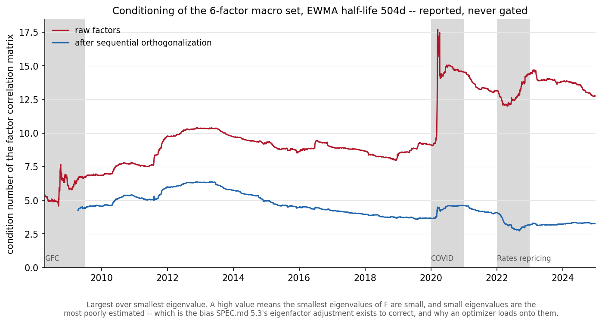

# Macro factor set -- correlations before and after orthogonalization

SPEC.md 4.1, as amended by SPEC.md 4.1.1. Generated by `python -m mafrm.factors.factor_report`; do not edit by hand.

Generated 2026-08-31T04:27:50Z. Window **2007-04-02 .. 2024-12-31**, 4,501 dates, 4,146 of them complete across all six factors. Nothing here reaches `holdout_start` = 2025-01-01.

## The six factors

| Factor | Construction | Unit | Orthogonalized against | First defined |
|---|---|---|---|---|
| `equity` | Ken French `Mkt-RF` (CRSP value-weighted US market excess return) | decimal daily excess return | -- | 2007-04-02 |
| `rates_level` | PC1 of GSW zero-yield changes at 2y/5y/10y/30y, scaled to a 1bp mean loading | basis points of yield | -- | 2007-04-02 |
| `rates_slope` | PC2 of the same, scaled so the 30y minus 2y loading is 1bp | basis points of yield | `rates_level` | 2008-04-02 |
| `credit` | `hy_credit` (HYG) total return less cash | decimal daily excess return | `equity`, `rates_level` | 2008-04-14 |
| `commodity` | `commodity` (DBC) total return less cash | decimal daily excess return | `dollar` | 2008-04-01 |
| `dollar` | `DTWEXBGS` return, sign +1 | decimal daily index return | -- | 2007-04-02 |

Units are mixed on purpose. Correlation and Gram-Schmidt are both scale-covariant, so the mixture costs nothing, and it buys the property that a regression of an asset return **in basis points** on the level factor reads directly as a negative effective duration -- which is what the duration check below tests.

`credit` is defined over cash rather than over a duration-matched Treasury, and its 252-day expanding-window burn-in against `equity` and `rates_level` is why it starts a year after the others. SPEC.md 4.1.1 records why the matched-Treasury leg was removed: with the orthogonalization in place it hedged the rates exposure a second time.

**`rates_slope` and `commodity` now carry the same burn-in, and that is W2-P2's doing.** SPEC.md 4.1.3 moved the Gram-Schmidt's expanding window to open at `sample.start` rather than at the beginning of available history, so no hedge ratio is estimated on data the model window does not contain. The ragged left edge is the price and it is not a new one: it lands on `credit`'s existing 2008-04-14 rather than adding a third edge, and the number of dates on which all six factors exist is unchanged at 4,146.

## Correlation matrices, side by side

Both are computed on the **same 4,146 rows** -- the dates on which every orthogonalized factor exists. Using each matrix's own complete cases would let the 'before' matrix include a burn-in window the 'after' matrix cannot have, and part of the difference between them would then be a difference of sample.

### Before

| | equity | rates_level | rates_slope | credit | commodity | dollar |
|---|---|---|---|---|---|---|
| **equity** | +1.000 | +0.296 | +0.150 | +0.680 | +0.433 | -0.320 |
| **rates_level** | +0.296 | +1.000 | +0.167 | +0.106 | +0.216 | -0.007 |
| **rates_slope** | +0.150 | +0.167 | +1.000 | +0.132 | +0.146 | -0.144 |
| **credit** | +0.680 | +0.106 | +0.132 | +1.000 | +0.372 | -0.384 |
| **commodity** | +0.433 | +0.216 | +0.146 | +0.372 | +1.000 | -0.412 |
| **dollar** | -0.320 | -0.007 | -0.144 | -0.384 | -0.412 | +1.000 |

### After

| | equity | rates_level | rates_slope | credit | commodity | dollar |
|---|---|---|---|---|---|---|
| **equity** | +1.000 | +0.296 | +0.153 | +0.067 | +0.302 | -0.320 |
| **rates_level** | +0.296 | +1.000 | +0.096 | -0.068 | +0.224 | -0.007 |
| **rates_slope** | +0.153 | +0.096 | +1.000 | +0.063 | +0.070 | -0.165 |
| **credit** | +0.067 | -0.068 | +0.063 | +1.000 | +0.015 | -0.230 |
| **commodity** | +0.302 | +0.224 | +0.070 | +0.015 | +1.000 | +0.085 |
| **dollar** | -0.320 | -0.007 | -0.165 | -0.230 | +0.085 | +1.000 |

## What the orthogonalization was asked to do, and did

| Pair | Before | After | In SPEC.md 4.1's scheme |
|---|---|---|---|
| `equity` / `credit` | +0.680 | +0.067 | **yes** |
| `equity` / `commodity` | +0.433 | +0.302 | no |
| `commodity` / `dollar` | -0.412 | +0.085 | **yes** |
| `credit` / `dollar` | -0.384 | -0.230 | no |
| `credit` / `commodity` | +0.372 | +0.015 | no |
| `equity` / `dollar` | -0.320 | -0.320 | no |
| `equity` / `rates_level` | +0.296 | +0.296 | no |
| `rates_level` / `commodity` | +0.216 | +0.224 | no |
| `rates_level` / `rates_slope` | +0.167 | +0.096 | **yes** |
| `equity` / `rates_slope` | +0.150 | +0.153 | no |
| `rates_slope` / `commodity` | +0.146 | +0.070 | no |
| `rates_slope` / `dollar` | -0.144 | -0.165 | no |
| `rates_slope` / `credit` | +0.132 | +0.063 | no |
| `rates_level` / `credit` | +0.106 | -0.068 | **yes** |
| `rates_level` / `dollar` | -0.007 | -0.007 | no |

**SPEC.md 4.1's own numerical claim holds.** Credit and equity run +0.680 before -- the spec says "~0.7 correlated" -- and +0.067 after. The largest absolute correlation anywhere in the set falls from 0.680 to 0.320.

## Gate -- the four pairs the scheme actually targets

SPEC.md 4.1.2. The original W2-P1 acceptance bar -- no pair above 0.15 -- **was withdrawn as invalid**, not lowered. Two reasons, and the second is the serious one.

It was **unmeetable**: SPEC.md 4.1's scheme names three pairings, equity is first in the order and is never projected off anything, so `equity`/`dollar`, `equity`/`commodity` and `equity`/`rates_level` are whatever the market delivers. No correct implementation could have passed. And meeting it would have been **harmful**: SPEC.md 5.1 estimates a K-by-K factor correlation matrix at a 504-day half-life and SPEC.md 5.3 runs the eigenfactor adjustment on that matrix's *eigenspectrum*. Both presume off-diagonal structure. Forcing every pair under the bar drives `F` toward diagonal and leaves the project's central technique with nothing to operate on. USE4 orthogonalizes two pairs and leaves the rest correlated for exactly this reason.

What survives is the same 0.15 level criterion **scoped to the pairs `against` targets**, where it asks whether the orthogonalization did its job rather than asking the factor set to be uncorrelated. A pair the scheme does not touch cannot be a gate on the scheme.

| Pair | Before | After | Fall | Criterion | Outcome |
|---|---|---|---|---|---|
| `rates_slope` / `rates_level` | +0.167 | **+0.096** | +43% | abs(after) <= 0.15 | pass |
| `credit` / `equity` | +0.680 | **+0.067** | +90% | abs(after) <= 0.15 | pass |
| `credit` / `rates_level` | +0.106 | **-0.068** | +36% | abs(after) <= 0.15 | pass |
| `commodity` / `dollar` | -0.412 | **+0.085** | +79% | abs(after) <= 0.15 | pass |

**4 of 4 meet the criterion outright**, and the two the spec makes a claim about are the two that move furthest: credit-equity +0.680 -> +0.067 against SPEC.md 4.1's stated "~0.7 correlated", and commodity-dollar -0.412 -> +0.085.

## Conditioning -- reported, never gated

This replaces the withdrawn pairwise bar as what W2-P1 measures about the factor set's conditioning, and it is the direct measurement of the failure mode CLAUDE.md ranks second: *the covariance matrix goes near-singular in exactly the crises that matter*. The condition number of the factor correlation matrix -- largest eigenvalue over smallest -- estimated at the same 504-day half-life SPEC.md 5.1 uses, on every observation through each date with exponentially decaying weights.

**The figures below were re-based in W3-P1b and are not the ones `experiments.md` row 68 published.** This diagnostic demeaned its EWMA moments through W3-P1 while the covariance pipeline took its moments about zero (SPEC.md 5.1.1); it now calls `mafrm.risk.covariance`'s own estimators, so the matrix diagnosed here is bit-identical to the one the pipeline builds rather than a differently-centred lookalike. That is a consistency fix -- two code paths computing one statistic two ways is a trap for whoever compares them next -- and not a moved goalpost: the whole-sample raw maximum went from 17.7283 to 17.7081 and the orthogonalized maximum from 6.4026 to 6.3747, so **every figure row 68 published to one decimal place is unchanged**. `experiments.md` rows 93-95 bounded the shift at 0.005 of a correlation before the change was made, which is what made it cheap.

**It is not a gate and must never become one.** A condition number is a property of the market in that window -- factors genuinely do co-move in a crisis -- not a property of the implementation, so there is no value of it that would mean this code is wrong.

| Window | Raw: median / max | Orthogonalized: median / max | Raw dates | Orth dates |
|---|---|---|---|---|
| Whole sample | 9.27 / 17.71 | 4.41 / 6.37 | 4,146 | 3,895 |
| **GFC** 2008 | 6.03 / 7.66 | 4.41 / 4.53 | 304 | 53 |
| **COVID** 2020 | 14.60 / 17.71 | 4.55 / 4.62 | 249 | 249 |
| **Rates repricing** 2022 | 12.70 / 14.41 | 3.13 / 4.09 | 249 | 249 |

**The orthogonalization's real justification is here, and it is now measured rather than asserted.** Raw conditioning deteriorates sharply in exactly the windows CLAUDE.md warns about -- the raw factor correlation matrix reaches a condition number of 17.7 against a whole-sample median of 9.3 -- while the orthogonalized set peaks at 6.4. The scheme is not making the factors uncorrelated; it is removing the shared directions that collapse the spectrum when everything moves together, and leaving the rest of the off-diagonal structure intact for the covariance pipeline to estimate.

**What SPEC.md 5.3's eigenfactor adjustment exists to handle is the number in this table.** A high condition number means the smallest eigenvalues of `F` are small, and small eigenvalues are the most poorly estimated ones -- sampling error biases them downward. An optimizer minimising forecast risk will load onto exactly those directions, because they are where the model says risk is cheapest, so the understatement is not spread evenly across portfolios but concentrated in the ones the optimizer chooses. That is the mechanism behind pre-registered hypothesis H2 (bias statistics of 1.2-1.5 on optimizer-selected portfolios against ~1.0 on random ones) and the Monte Carlo eigenfactor adjustment is what corrects it. The condition numbers above are the size of the problem it will be asked to solve on this factor set.

**One asymmetry to read carefully.** The two series do not start on the same date. Raw `credit` exists from HYG's inception, but orthogonalized `credit` needs a 252-day burn-in against equity and level, so the orthogonalized condition number begins 2009-04-16 against the raw series' 2008-04-14. The GFC row therefore compares a nearly complete raw window against a partial orthogonalized one and should not be read as a like-for-like ratio; COVID and the 2022 rates repricing are fully covered by both.

A further caveat on the left edge of both series: `min_observations` is 252, deliberately shorter than the EWMA effective sample size at a 504-day half-life (1454 days). Requiring the latter would start the series in 2014 and miss every crisis the diagnostic exists to show. The earliest estimates therefore carry near-flat weights and are closer to a sample correlation than to a converged EWMA.

## What the eigendecomposition did

| Factor | Estimation dates | Sign fix fired | Orientation reversals | Shape violations |
|---|---|---|---|---|
| `rates_level` | 9,509 | 9,509 (100.0%) | 0 | 0 |
| `rates_slope` | 9,509 | 9,509 (100.0%) | 0 | 0 |

**The sign fix fires on every single date and that is the expected result, not an instability.** `numpy.linalg.eigh` returns an orientation that is arbitrary but deterministic, and for a covariance matrix of yield changes -- every entry positive -- it consistently hands back the level eigenvector pointing "yields down". The convention flips it every time. The number that would signal instability is the next column, and it is **zero**: after the convention is applied, the loading vector never reverses against the previous date's. One day of data cannot rotate a stable eigenvector through 90 degrees, so a nonzero count there would mean PC1 and PC2 were swapping places and the two factors were changing meaning mid-sample.

Variance shares over the model window: level 0.831-0.836, slope 0.118-0.124. Level is the dominant mode on every date.

Mean level loadings over the model window, in basis points -- these average to exactly 1 by construction, and their **shape** is what the duration bands below were sized for:

| Tenor | y2 | y5 | y10 | y30 |
|---|---|---|---|---|
| Mean loading (bp) | 0.921 | 1.116 | 1.070 | 0.893 |

## Duration check -- experiments.md rows 64-67

Pre-registered **before this module existed**. Each instrument's excess return, in basis points, regressed by OLS on the normalized level factor, in basis points. If the normalization is right the slope is minus the effective duration in years.

| # | Instrument | Predicted | Band | Measured | Implied duration | R² | Outcome |
|---|---|---|---|---|---|---|---|
| 64 | `govt_10y` | -10.00 | [-12.50, -7.50] | **-11.22** (se 0.04) | 11.22y | 0.940 | pass |
| 65 | `govt_2y` | -2.00 | [-2.50, -1.50] | **-1.65** (se 0.02) | 1.65y | 0.720 | pass |
| 66 | `tlt` | -15.40 | [-19.25, -11.55] | **-16.26** (se 0.14) | 16.26y | 0.761 | pass |
| 67 | `hy_credit` | -3.50 | [-4.00, -3.00] | **+1.49** (se 0.20) | -1.49y | 0.013 | **REFUTED** |

**3 of 4 inside the registered band.** The three instruments whose return is pure duration -- two synthetic zeros and TLT -- all land inside, and their deviations run the right way: the level PC's loading is hump-shaped, low at 2y and high at 5-10y, so the 2y reads short of its two years and the 10y reads long of its ten. That shape is exactly what the ±25% band was sized for, and it was sized before any of these numbers existed.

### Row 67 is REFUTED, and the band is not widened

HYG's registered prediction was -3.0 to -4.0, the analytical effective duration of a high-yield portfolio. It measures **+1.49** -- the wrong sign -- with an R² of 0.013. The prediction is refuted and recorded as refuted.

**The construction is not the suspect, and the other three rows are why.** A sign error, a units error or a reciprocal scale in the normalization would move all four instruments together; three of them land on their predictions. What row 67 measures is HY's *empirical* rates exposure rather than its analytical duration, and for high yield the two are famously different: yields rise in risk-on conditions and HY spreads tighten at the same time, so the spread channel offsets and then overwhelms the duration channel. Controlling for the equity factor confirms exactly that -- HYG's coefficient on the level factor moves from +1.49 univariate to **-1.36** with equity in the regression, and the R² rises from 0.013 to 0.453.

**This independently justifies the SPEC.md 4.1.1 amendment**, which was made on reasoning alone before any of this was measured. The original spec would have subtracted a duration-matched Treasury leg from HY. Matched at HY's analytical duration of ~3.5y, that would have removed roughly 3.5 years of rates exposure from an instrument whose measured exposure is +1.5 gross and -1.4 net of equity: the correction would have been two to three times the size of the thing it was correcting, and pointed the wrong way. The estimated, time-varying hedge that replaced it gets the sign and the size from the data.

## Open, and owed to a later session

1. **The expanding-window start date -- CLOSED in W2-P2 (SPEC.md 4.1.3).** W2-P1 reported `rates_slope`/`rates_level` as worse after the hedge than before it, because the level/slope relationship changes sign across the burn-in boundary, and registered the alternative window start as a `model-config` question rather than sweeping it in the session that reported the shortfall. W2-P2 ran it: the window now opens at `sample.start`, the pair measures +0.096 against +0.167 before, and the exemption it held has been discharged rather than kept as a spare. `experiments.md` row 69 carries the decision and records that it was taken on the sign-change measurement before the resulting correlation was known.
2. **Whether `equity` should be orthogonalized against anything.** It is first in the order and is never projected off, so it carries every shared direction in the set: +0.296 with `rates_level`, +0.303 with `commodity`, -0.320 with `dollar`. SPEC.md 4.1's scheme is Barra's -- orthogonalize the pairs that would go near-singular and leave the rest -- and the conditioning table above says it is working. Reopening it is a specification question, not a defect.
3. **Rolling EWMA betas, per-asset R² and alpha live in `reports/asset_exposures.md`**, built in W2-P2 at a 252-day window and 63-day half-life. The duration check here keeps full-sample OLS deliberately -- one number per instrument at maximum precision is what a normalization check wants -- and the exposure report repeats it against the panel's own six-factor specification, on four synthetic zeros rather than two.

