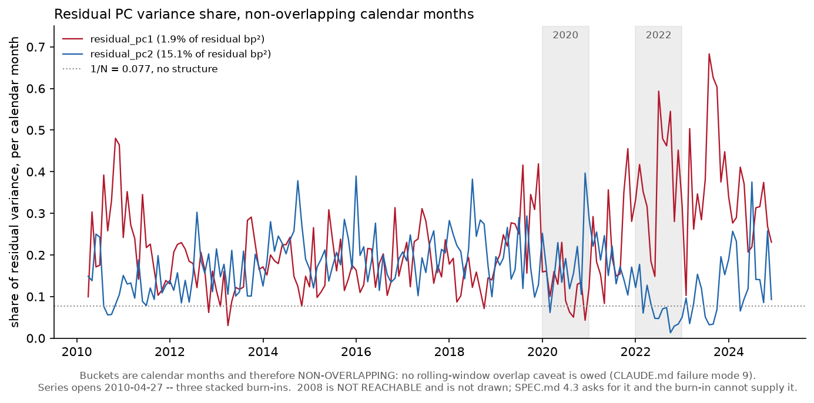

# The hybrid -- residual PCs on Model A. SPEC.md 4.3

Generated by `python -m mafrm.factors.hybrid_report`. Everything below stops
strictly before `sample.holdout_start` = **2025-01-01**
(CLAUDE.md invariant 5).

SPEC.md 4.3: *"Run PCA on the residuals of Model A and append the top 1-2
residual PCs as unnamed factors... Report Model A's R-squared alone and with the
residual PCs."* And, from experiments.md row 83, registered **2026-08-30** --
five sessions before this code existed and before any residual PC had been
extracted -- a verdict on whether those PCs are a missing real-rate factor or
noise.

## The headline

**Row 83 is REFUTED.** Neither residual PC loads materially on `gold`: it ranks
**11th of 13** on the first
component and
**11th of 13** on the
second, with mean absolute loadings of
0.0106 and
0.0237 against a
leading loading above 0.5 in both cases. The registered falsifier says what to do
with that: *"the residual PCs are noise and the hybrid adds nothing over the
macro core -- and that is the finding, reported as such rather than worked
around."*

**They are not noise, and that is the part the registration did not anticipate.**
The first residual PC is a real, strongly identified structure -- it is the
**third mode of the yield curve**, which the six-factor set cannot span because
it carries only two rate PCs. That is experiments.md rows 81-82's finding
arriving from the other direction, and three pre-registered controls below
establish it rather than assert it.

So the honest summary is neither of row 83's two branches. The hybrid does detect
systematic risk the named factor set missed. What it detected already has a name.

## What was built

| | |
|---|---|
| Residual panel | **3,889 dates x 13 assets**, 2009-04-16 to 2024-12-31, basis points per day |
| Dropped by complete-cases | 257 dates, reported rather than filled |
| Residual PC panel | **3,638 dates**, 2010-04-27 to 2024-12-31 |
| Estimator | `sample_correlation` on the residual **correlation** (SPEC.md 4.3.3), expanding window |
| Burn-in | 252 days, read from `factors.macro.rates.pca.expanding_min_window` -- no key of its own |
| Component counts | [1, 2] -- **both built, neither selected** |
| Denoising | **none**, and deliberately: SPEC.md 4.2.7 measured MP denoising as harmful at this `N/T` |
| Government control | `duration_effect` leg alone for `govt_10y`, `govt_2y`, `govt_30y`, `govt_5y` |
| Component stability | minimum alignment 0.9957 across dates |

**The government control is W2-P3's, fixed on 2026-08-30 before any residual PC
existed.** The four synthetic zeros are regressed on their duration leg alone --
`duration_effect` from SPEC.md 3.2's three-way decomposition -- because carry and
roll-down cannot be spanned by a factor set built from yield *changes* and would
otherwise put a term premium into the residual. `tips_10y` is deliberately not in
that set: its alpha was never flagged, so there is no measured term premium in it
to strip, and widening a pre-registered control after the fact is the move the
control exists to prevent.

## Row 83, as registered

The four criteria were ruled by the operator on 2026-08-31 **before the residual
panel was computed**, and every one is rank- or comparison-based so that none of
them is a magnitude anyone chose.

| Clause | Rule | Null rate |
|---|---|---|
| (a) "loads materially on gold" | `gold` holds the **largest absolute loading** on the component | `1/13` = **0.0769** |
| (b) "correlates with TIPS" | **placebo**: `abs(rho(PC, d.real 10y)) > abs(rho(PC, d.nominal 10y))` | **0.5000** |
| (c) the sign | with the PC oriented so `gold`'s loading is positive, `rho` with the real-yield change must be **negative** | **0.5000** |
| all three, one component | | `1/52` = **0.0192** |
| clause (a), at least one of 2 | | union **0.1538**, independent **0.1479** |
| all three, at least one of 2 | | union **0.0385**, independent **0.0381** |

**These were computed and written down before the result was, and they are
printed here because a criterion met is not a finding until its null rate is next
to it.** The union bound and the independent form are both given: they are not
independent -- eigenvectors of one matrix are orthogonal -- so the independent
figure is an approximation and is labelled as one. "At least one of two
components passes" is a materially weaker claim than "the first one does", and
the two rows above keep them apart.

**Clause (b) is a placebo and not a significance bar.** At
n = 3,638 a two-sided 5% test
passes at abs(rho) > 0.0325,
which has no teeth, and the 0.3 bar SPEC.md 6.5.2 withdrew is not reimported. The
six-factor set already contains a nominal level factor, so a PC that is merely
more nominal-rates exposure fails the placebo while a genuine real-rate factor
cannot. The two comparand legs are correlated at
0.7693 over
6,492 dates, which is why the placebo is the right shape of
test and a bare correlation with the real leg would not be.

## The result

At **2 components**:

| Component | Clause (a): gold ranks first | Clause (b): real beats nominal | Clause (c): sign is negative | All three |
|---|---|---|---|---|
| `residual_pc1` | **fails** -- rank **11** of 13, abs(loading) 0.0106 against `govt_2y`'s 0.5563 | holds -- abs(rho_real) 0.1103 vs abs(rho_nom) 0.1040 | holds -- rho_real -0.1103 | **FAILS** |
| `residual_pc2` | **fails** -- rank **11** of 13, abs(loading) 0.0237 against `us_small_equity`'s 0.5479 | holds -- abs(rho_real) 0.0598 vs abs(rho_nom) 0.0380 | holds -- rho_real -0.0598 | **FAILS** |

At **1 component**, the same first row, bit-identical -- the expanding-window
decomposition does not depend on how many of its components are kept:

| Component | Clause (a): gold ranks first | Clause (b): real beats nominal | Clause (c): sign is negative | All three |
|---|---|---|---|---|
| `residual_pc1` | **fails** -- rank **11** of 13, abs(loading) 0.0106 against `govt_2y`'s 0.5563 | holds -- abs(rho_real) 0.1103 vs abs(rho_nom) 0.1040 | holds -- rho_real -0.1103 | **FAILS** |

**Clauses (b) and (c) both hold on both components. Clause (a) fails on both, so
the hypothesis fails.** Row 83's hypothesis is a conjunction -- *"at least one
residual PC will (a) load materially on gold **and** (b) correlate with the TIPS
real-yield series"* -- and its falsifier is explicit that failing either branch
refutes it.

**It is not close.** Row 83 asked for the loading vector "regardless of outcome,
so a near-miss is visible rather than collapsed into a pass/fail". Here it is,
mean loading per asset over the sample:

| Asset | `residual_pc1` | `residual_pc2` |
|---|---|---|
| `govt_2y` | -0.5563 | -0.0207 |
| `govt_30y` | -0.5492 | -0.0954 |
| `us_small_equity` | -0.0402 | +0.5479 |
| `us_large_equity` | +0.0944 | -0.5373 |
| `govt_10y` | +0.5267 | +0.0475 |
| `dev_ex_us_equity` | +0.0328 | -0.4151 |
| `em_equity` | -0.0025 | -0.3301 |
| `hy_credit` | +0.0050 | +0.2503 |
| `govt_5y` | +0.1976 | -0.0095 |
| `tips_10y` | +0.1966 | +0.0695 |
| `commodity` | +0.1031 | -0.1426 |
| `ig_credit` | +0.0792 | -0.0753 |
| `gold` **<- row 83's asset** | +0.0106 | +0.0237 |

`gold` sits at 0.0106
on the first component against `govt_2y`'s
0.5563. That is a
factor of 52,
not a rounding.

### The two sign conventions, and why the agreement share is printed

A PC's sign is unidentified, so clause (c) is stated sign-invariantly: each
date's component is oriented so that `gold`'s loading is
positive, and the correlation must then be negative. That is the **test**
convention. The factor series handed downstream instead uses SPEC.md 4.2.3's
**continuity** convention -- aligned against the previous date, seeded on the
largest-magnitude loading -- because a factor series must not flip on a date when
one loading crosses zero.

The two agree on
**90.8%** of dates for `residual_pc1`, **95.2%** of dates for `residual_pc2`.
A low share would have meant `gold`'s
loading is not stably signed and the test orientation is close to a coin flip.
These are high, so clause (c) is testing something -- which matters, because
clause (c) passed.

## Why the first residual PC is the third curve mode

Three controls, **each registered with its prediction and falsifier before it
ran**, and each rank- or comparison-based.

### C1 -- the residuals against the four raw yield changes

Row 82 established that `duration_effect` is exactly linear in the four raw yield
changes (R-squared = 1.000000). If the leading residual PC is the unspanned curve
modes, the four government residuals must be far better explained by those raw
changes than anything else in the panel.

**Predicted:** every government residual has a higher R-squared than every
non-government residual. **Falsified if** any non-government asset exceeds the
smallest government one.

| Asset | R-squared on the four raw yield changes |
|---|---|
| `govt_10y` | 0.8340 |
| `govt_2y` | 0.6499 |
| `govt_30y` | 0.6361 |
| `govt_5y` | 0.6321 |
| `tips_10y` | 0.0307 |
| `ig_credit` | 0.0159 |
| `hy_credit` | 0.0086 |
| `em_equity` | 0.0049 |
| `us_small_equity` | 0.0032 |
| `commodity` | 0.0030 |
| `us_large_equity` | 0.0025 |
| `gold` | 0.0014 |
| `dev_ex_us_equity` | 0.0004 |

**HOLDS.** The four government residuals run
0.6321
to
0.8340;
the largest non-government value is
0.0307
(`tips_10y`).
A factor of twenty separates the two groups.

### C2 -- the PC itself, raw changes against the model's own rate factors

**Predicted:** `residual_pc1` is far better explained by the four raw yield
changes than by the model's two orthogonalized rate factors, and the latter is
near zero -- because `rates_level` and `rates_slope` were regressed *out* of
the residual by construction, so the PC must live in the orthogonal complement of
their span inside the four-dimensional yield-change space. **Falsified if** the
two rate factors explain as much or more, which would make the PC leaked factor
exposure -- a regression defect -- rather than an unspanned curve mode.

| Component | R-squared on 4 raw yield changes | R-squared on `rates_level` + `rates_slope` | correlation with the 2-2x10+30 butterfly |
|---|---|---|---|
| `residual_pc1` | 0.6247 | 0.0002 | +0.6272 |
| `residual_pc2` | 0.0070 | 0.0020 | +0.0717 |

**HOLDS, and decisively.** `residual_pc1` is at
0.6247 on the raw curve and
0.0002 on the factors the residual
was constructed to be orthogonal to -- the second number is the construction
checking itself. Its correlation with the named curvature butterfly is
+0.6272.

**This is the third curve mode, and rows 81-82 already closed it as an attributed
component rather than a residual.** A third rate factor (curvature) would remove
it; that is a specification decision owing its own `model-config` row, and
nothing here takes it.

### C3 -- the two identity assets

`commodity` and `hy_credit` regress on the macro set at
R-squared = 1.000 because the proxy IS the factor -- SPEC.md 4.1.1. Their "residuals" are the numerical
remainder of an exact linear identity, not observations. W2-P2's forward
constraint scopes their exclusion to **aggregate bias statistics** and says
explicitly that they stay in the exposure panel and the reports -- so it does not
reach a residual PCA. But a correlation PCA standardises every column to unit
variance, which hands two columns of numerical noise the same weight as `gold`.
That is a question to measure, not to assume.

**Predicted:** dropping them (N = 11) does not
change row 83's verdict. **Falsified if** `gold` reaches rank 1 on either
component, in which case the N = 13 reading is contaminated and the
refutation would have been withdrawn and re-run at
N = 11.

| Component | gold's rank at N = 11 | leading asset | verdict |
|---|---|---|---|
| `residual_pc1` | **10** of 11 | `govt_2y` | **FAILS** |
| `residual_pc2` | **11** of 11 | `us_small_equity` | **FAILS** |

**HOLDS.** The verdict is unchanged and the leading loadings barely move. The
refutation is not an artefact of the two identity columns.

## Model A's R-squared, alone and with the residual PCs

| Asset | Model A | +1 PC | +2 PC | gain (+1) | gain (+2) |
|---|---|---|---|---|---|
| `commodity` | 1.0000 | 1.0000 | 1.0000 | +0.0000 | +0.0000 |
| `dev_ex_us_equity` | 0.8027 | 0.8043 | 0.8563 | +0.0015 | +0.0536 |
| `em_equity` | 0.6714 | 0.6752 | 0.7329 | +0.0038 | +0.0615 |
| `gold` | 0.4033 | 0.4102 | 0.4163 | +0.0069 | +0.0130 |
| `govt_10y` | 0.9814 | 0.9953 | 0.9956 | +0.0140 | +0.0142 |
| `govt_2y` | 0.9620 | 0.9948 | 0.9952 | +0.0328 | +0.0331 |
| `govt_30y` | 0.9965 | 0.9996 | 0.9996 | +0.0031 | +0.0032 |
| `govt_5y` | 0.9923 | 0.9932 | 0.9932 | +0.0008 | +0.0009 |
| `hy_credit` | 1.0000 | 1.0000 | 1.0000 | +0.0000 | +0.0000 |
| `ig_credit` | 0.8295 | 0.8330 | 0.8355 | +0.0035 | +0.0060 |
| `tips_10y` | 0.7559 | 0.7774 | 0.7792 | +0.0214 | +0.0232 |
| `us_large_equity` | 0.9901 | 0.9902 | 0.9961 | +0.0001 | +0.0060 |
| `us_small_equity` | 0.8447 | 0.8461 | 0.9371 | +0.0015 | +0.0925 |

Median gain across the panel: **+0.0031** with one
residual PC and **+0.0130** with two.

**Every column is estimated on the same rows, and that correction is itself a
finding.** A first version of this table read Model A's R-squared from the
exposure panel and the augmented ones from a design starting
251 rows later. Three assets came out
with a **negative** gain from adding a regressor, which cannot happen inside one
regression. A rolling window is 252 *rows*, not 252 calendar days, so the two
runs were covering different spans and were never like-for-like. Re-estimating
the baseline on the augmented design's own index removes every negative: the
worst per-date gain across the panel is now **+1.1e-16**. The control that caught
it (C4) is logged in `experiments.md` with its prediction refuted, because the
prediction *was* refuted -- it said the negatives were a date-set artefact that
would vanish on the intersection, and they did not, because the intersection was
still comparing two different window contents.

**The comparison is descriptive and in-sample by construction, and that is the
whole of its honest reading.** The PC at date `t` is a linear combination of that
same date's residuals, so on a shared design the augmented R-squared cannot fall.
It answers "how much of what the six factors missed is common across assets". It
does **not** answer "would this factor have helped out of sample", and nothing
here claims it does. A forecast comparison is the covariance pipeline's job.

The two assets at 1.0000 are the identity pair above; `commodity` and
`hy_credit` have nothing left to explain.

## Variance share -- and the year that is not reachable

SPEC.md 4.3 asks for the residual PC's variance share charted **through 2008,
2020 and 2022**. 2020, 2022 are there.
**2008 is not, and the chart says so rather
than opening in 2010 and letting a reader assume otherwise.**

The residual PCs carry three stacked burn-ins: the credit factor's expanding
window, the 252-day beta regression, and the
residual PCA's own 252-day expanding window. The series
opens **2010-04-27**. The August 2007 quant quake that SPEC.md 4.3
names as the motivating case is further out of reach still. **This is the second
time a SPEC.md figure has asked for a date this project's burn-in cannot supply**,
after SPEC.md 5.4.3's Aug 2007. That is a narrower family than SPEC.md 5.4.3's own
count of five gates calibrated for a case this project is not in -- the other
three are thresholds rather than dates -- and both counts are right at their own
scope. The pattern here is the specific one: a specification written before the
burn-in was known will name crises the model cannot see, and this build's burn-in
is three stacked windows rather than one.

| Year | `residual_pc1` mean / max | `residual_pc2` mean / max |
|---|---|---|
| 2020 | 0.121 / 0.230 | 0.181 / 0.397 |
| 2022 | 0.380 / 0.593 | 0.074 / 0.177 |
| whole sample | 0.200 / 0.683 | 0.165 / 0.397 |

**The buckets are calendar months and therefore non-overlapping.** That is why no
overlap caveat appears beside any number in this section, and it is why no window
length was invented for it. CLAUDE.md failure mode 9 is about rolling windows
read as independent observations; a share stepped daily would share 251 of its
252 days with its neighbour and every reading would owe the caveat. Months owe
none.

**`residual_pc1` peaks in 2022-23, not in a crisis**, at
0.683 in 2023-08,
which is exactly what the curve-mode diagnosis predicts: 2022-23 is when the
curve moved in ways two PCs could not span. `residual_pc2` peaks at
0.397 in 2020-12.

### The correlation share and the basis-point share point opposite ways

| Component | share of the correlation trace (last date) | share of residual variance in bp² |
|---|---|---|
| `residual_pc1` | 0.2239 | **0.0187** |
| `residual_pc2` | 0.1255 | **0.1508** |

**Both are reported because either one alone misleads.** `residual_pc1` holds
22.4% of the correlation trace and
only 1.9% of the actual residual
variance: it is four government residuals with standard deviations of
9.0, 1.6, 12.2, 2.7
bp/day moving in near-lockstep, and a correlation PCA weights them equally with
`gold`'s 73.6 bp/day. `residual_pc2` is the
reverse -- less of the trace, **15.1%**
of the variance -- because it is the equity sleeve, where the variance actually
is.

**This is not an argument for a covariance PCA.** That would have returned `gold`
and `em_equity` as the leading direction because they are the most volatile
residuals, which is experiments.md row 96's units artefact and the reason
SPEC.md 4.3.3 rules for the correlation. The right response is to print both
numbers, which is what the table does.

## SPEC.md 15.2 -- the hybrid through the covariance pipeline, unchanged

**Nothing in `src/mafrm/risk/` was changed, added to, or special-cased to make
this run.** The hybrid factor frame goes into `run_pipeline` through the same
call `mafrm.build` makes for Model A and `statistical_report.acceptance` makes
for Model B: a `T x K` frame and a `RiskConfig`. `git diff` on `src/mafrm/risk/`
for this session is empty, and `tests/test_risk_architecture.py` continues to
enforce that `risk/` imports nothing from `factors/`.

**This is the harder version of the test than Model B was, and that is why it is
worth running twice.** Model B's factors are a homogeneous statistical basis --
every column the same kind of object, built the same way, on the same scale. The
hybrid's frame mixes **six named macro factors in two different units** with one
or two **dimensionless residual components**:

| Column | Unit | Standard deviation |
|---|---|---|
| `equity` | decimal daily return | 0.01123 |
| `rates_level` | basis points of yield | 4.756 |
| `rates_slope` | basis points of yield | 5.056 |
| `credit` | decimal daily return | 0.003354 |
| `commodity` | decimal daily return | 0.01005 |
| `dollar` | decimal daily return | 0.003249 |
| `residual_pc1` | dimensionless (residual PC) | 1.765 |
| `residual_pc2` | dimensionless (residual PC) | 1.265 |

Three scales spanning about three orders of magnitude, in one matrix. **If
`risk/` held an asset-class assumption anywhere, this is the frame that would
surface it.** It did not.

### All eight combinations, PSD at every stage

Both component counts x both horizons x both eigenfactor scalings, exactly as
W3-P5 ran Model B across its eight. `a = 1.0` is attribution-facing and `a = 1.4`
optimizer-facing (CLAUDE.md's parameter table); both are carried and neither is
chosen here.

Each cell is the **minimum eigenvalue after that stage**, which is CLAUDE.md
invariant 4's assertion made visible rather than merely executed:

| Run | K | T | `ewma` | `newey_west` | `psd_repair` | `eigenfactor` | `volatility_regime` | cond | lambda_F^2 | PSD |
|---|---|---|---|---|---|---|---|---|---|---|
| +1 PC, short, a = 1.0 | 7 | 3,638 | 4.41e-06 | 3.87e-06 | 3.87e-06 | 3.91e-06 | 3.97e-06 | 9.44e+06 | 1.0139 | **yes** |
| +1 PC, short, a = 1.4 | 7 | 3,638 | 4.41e-06 | 3.87e-06 | 3.87e-06 | 3.93e-06 | 3.98e-06 | 9.39e+06 | 1.0137 | **yes** |
| +1 PC, long, a = 1.0 | 7 | 3,638 | 6.31e-06 | 5.72e-06 | 5.72e-06 | 5.80e-06 | 5.04e-06 | 7.63e+06 | 0.8680 | **yes** |
| +1 PC, long, a = 1.4 | 7 | 3,638 | 6.31e-06 | 5.72e-06 | 5.72e-06 | 5.83e-06 | 5.06e-06 | 7.58e+06 | 0.8679 | **yes** |
| +2 PC, short, a = 1.0 | 8 | 3,638 | 4.40e-06 | 3.83e-06 | 3.83e-06 | 3.89e-06 | 3.91e-06 | 9.48e+06 | 1.0074 | **yes** |
| +2 PC, short, a = 1.4 | 8 | 3,638 | 4.40e-06 | 3.83e-06 | 3.83e-06 | 3.91e-06 | 3.93e-06 | 9.41e+06 | 1.0075 | **yes** |
| +2 PC, long, a = 1.0 | 8 | 3,638 | 6.30e-06 | 5.68e-06 | 5.68e-06 | 5.78e-06 | 5.17e-06 | 7.65e+06 | 0.8951 | **yes** |
| +2 PC, long, a = 1.4 | 8 | 3,638 | 6.30e-06 | 5.68e-06 | 5.68e-06 | 5.82e-06 | 5.21e-06 | 7.58e+06 | 0.8952 | **yes** |

**Every stage of every run is positive semi-definite, and every run is
complete** -- all five of SPEC.md 5's stages ran on all eight. The minimum
eigenvalues are positive by four to six orders of magnitude, not marginal, so
this is not a near-miss absorbed by a tolerance.

**The PSD repair did not fire on any of the eight**
(zero firings), and
neither did row 100's Bartlett fallback
(zero firings).
That is the expected result and it is the same reading as experiments.md rows 98
and 129: both remedies are `K/T_eff` phenomena, and at `K` = 7-8
against T = 3,638 the ratio is nowhere near where
either fires. **They are inert here, not absent** -- `reports/stage_k_dependence.md`
carries the four techniques whose value depends on `K`, and this is two more
measurements for that table rather than evidence the repairs are unnecessary.

### The condition number is units, and row 96 already ruled on that

The finished matrices condition at about
7.6e+06 to 9.5e+06.
**That is the mixed-unit scale of the factor panel, not near-singularity**, and
experiments.md row 96 settled the reading on Model A's own six-factor matrix
before the hybrid existed. Appending a residual PC with a standard deviation
around 1.8 into a frame that already spans 0.003 to 5.1 cannot make the
conditioning better and does not need to: SPEC.md 5.1 estimates volatility and
correlation **separately** precisely so that a level difference between factors
is carried in the volatility leg rather than in the correlation matrix the
eigen-decompositions act on, and SPEC.md 5.3.1's scale-invariance ruling is the
same point at the eigenfactor stage.

### What the VRA multiplier says, and what it does not

`lambda_F^2` runs 0.8679 to 1.0139
across the eight. So the **short** horizon UNDER-forecasts (1.0074-1.0139), and the **long** horizon OVER-forecasts (0.8679-0.8952). The two horizons disagree about the SIGN, which is the same pattern W3-P4 measured on Model A's own factors and has the same cause: a 252-day half-life on a panel containing 2020 and 2022. **No claim is made here
about whether the hybrid forecasts better than Model A.** That is a bias-statistic
question, it belongs to W4, and it needs the optimizer-selected portfolios of
SPEC.md 6.2 rather than a multiplier read off the calibration series it was fitted
on.

### Cost, and why the history is committed

The VRA stage consumes a bias history, which costs one full pre-VRA pipeline run
per date: **about thirteen minutes per column, and fifteen and a half minutes of
wall clock for all eight when they are fanned out across processes** (measured;
sequentially the same work takes about a hundred).

That gap is the reason `mafrm.history` exists. The forecast-history machinery had
been written three times -- `vra_report` in W3-P4, `statistical_report` in W3-P5,
this module in W3-P6 -- and parallelism arrived in each at a different session, so
this one started life without it. It had also diverged in both digest functions
and in the partial's float precision. `experiments.md` records the four
differences; the shared module now owns everything that must be identical, and
`tests/test_history.py` asserts the callers hold the same function objects rather
than merely equal values. `reports/hybrid_forecast_history.csv` is committed for the same reason
Model A's and Model B's are, and it carries the same two digests --
`risk_config_digest` and a per-panel `panel_digest`. The second is the one that
matters: a changed half-life shows up in `config/model.yaml`, but a **moved
factor series** does not, and W3-P5 hit exactly that failure. The hybrid is more
exposed to it than Model B, because its panel depends on the macro factors, the
exposure regression, the residual construction and the residual PCA -- four
modules that can move it independently.

## What is still wrong

1. **The hybrid's leading component is a known span limitation, not hidden
   risk.** SPEC.md 4.3 sells the residual PC as a crowding detector. What it
   detects here is the third curve mode, already attributed in W2-P2. The
   detector works; the thing it found has a name. A third rate factor would
   remove it and is **not** taken here, because adding one after a refuted
   pre-registration is the move the pre-registration exists to prevent.

2. **2008 is unreachable and the August 2007 case is further out of reach.** The
   most interesting thing SPEC.md 4.3 promised cannot be measured on this panel.
   Nothing fixes that inside the current sample window.

3. **`residual_pc2` is an equity dispersion component and is not tested.** Its
   loadings are `us_small_equity` against `us_large_equity` and the two
   international sleeves. Row 83 had nothing to say about it, and inventing a
   hypothesis for it now would be exactly the after-the-fact registration this
   session spent its budget avoiding. It is reported and left.

4. **The R-squared comparison remains in-sample.** It is what SPEC.md 4.3 asks
   for and it is not a forecast claim.

5. **The SPEC.md 15.2 acceptance says the pipeline ACCEPTS the hybrid, not that
   the hybrid forecasts well.** All eight runs are complete and PSD at every
   stage and nothing in `risk/` moved, which is the architectural claim and the
   whole of it. Whether these matrices are better calibrated than Model A's is a
   bias-statistic question that needs SPEC.md 6.2's optimizer-selected portfolios,
   and it belongs to W4.

6. **The residual PCs inherit the hybrid panel's burn-in into the pipeline.** The
   factor frame opens 2010-04-27 against Model A's own 2008-04-14, so any later
   comparison of hybrid and Model A covariance forecasts must be run on the
   common window or it will be comparing two different samples. Nothing here does
   that comparison; this is a note for the session that will.
