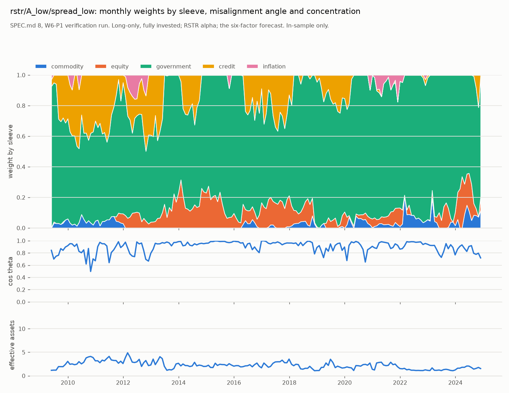

# Optimizer verification: one configuration, stated as verification and not as a result

Generated by `python -m mafrm.backtest.verification`. SPEC.md 8 under the rulings of SPEC.md 8.5.1, W6-P1.

**This is not the experiment grid and it publishes no Sharpe ratio.** SPEC.md 8.5.1 ruling 6: W6-P1 runs ONE configuration to show that the optimizer solves on every date without an unhandled failure, what binds, and what the weights and the misalignment angle look like. SPEC.md 9's grid is W6-P2's job, and the moment any of these numbers is compared against an alternative on outcome, the rows in `experiments.md` change category.

## The configuration

| Ingredient | Value | Where ruled |
|---|---|---|
| `alpha-hat` | RSTR (SPEC.md 15.4): T = 504, half-life 126, lag 21; normalised weights, equal-weighted cross-sectional centring, scaled to 21 sessions | ruling 1; construction at SPEC.md 8.5.1 |
| Risk forecast | `eigen_a1`: + SPEC.md 5.3 eigenfactor, a = 1 (attribution-facing, USE4 production); short horizon, the matrix behind W4-P2's family-4 headline | ruling 6, SPEC.md 6.2.2 |
| `gamma_risk` | SPEC.md 8.4's `IR / (2 TE_target)` at each rebalance | SPEC.md 8.4 |
| `TE_target` | 1 x the equal-weight book's realised in-sample volatility: 0.492%/day, 2.253%/period | ruling 3 |
| Costs | SPEC.md 7.1 inside the objective; `Y` patient = 0.58, exponent 1.5, `gamma_trade` = 1; half-spread at both ends of the issuer interval | ruling 6, SPEC.md 7.1.3 |
| `psi_mis` | `msci`: `lambda * u' Sigma u` on the unit `alpha_perp` direction, computed each rebalance | ruling 4; construction |
| `rho`, `varrho`, `gamma_hold`, `w^b` | 0, 0, 0, zero -- absences | ruling 4 |
| Constraints | long-only, fully invested (hard, the simplex); ADV cap 6% of ADV HARD (multipliers observed); box 1 and turnover 2 at their simplex maxima; TE hinge off | ruling 5 |
| Ladder | adv_participation -> prior weights; solvers CLARABEL then SCS | SPEC.md 8.1 |
| Book size | A_low = $405,995 / A_high = $40.6M (the ruled AUM grid's endpoints read off the equal-weight trade in `commodity`, median ADV $31.2M) | construction at SPEC.md 8.5.1 |
| Calendar | 187 month-end rebalances, 2009-05-29 to 2024-11-29, held through 2024-12-31; 0 early month end(s) dropped while RSTR's 525-session window filled | SPEC.md 2 |

## Did it solve

| Configuration | NAV | Rebalances | Solved at rung 0 | `optimal_inaccurate` | Constraint relaxed | Fell back to prior weights |
|---|---|---|---|---|---|---|
| rstr/A_low/spread_low | $405,995 | 187 | 187 | 0 | 0 | 0 |
| rstr/A_low/spread_high | $405,995 | 187 | 187 | 1 | 0 | 0 |
| rstr/A_high/spread_low | $40.6M | 187 | 187 | 0 | 0 | 0 |
| rstr/A_high/spread_high | $40.6M | 187 | 187 | 0 | 0 | 0 |
| zero/control | $405,995 | 187 | 187 | 0 | 0 | 0 |

Every rebalance of every configuration solved at the first rung with the primary solver. The ladder was never entered.

## What the RSTR optimizer did (SPEC.md 8.5.1 ruling 7)

`N = 13`. `cos theta = ||alpha_R|| / ||alpha||` per SPEC.md 8.3; effective assets is `1 / sum w^2` (13 at equal weight, 1 at a corner); a rebalance is a CORNER when at least `N - 2` = 11 weights sit on the long-only floor.

| Configuration | median `cos theta` | min `cos theta` | median `gamma_risk` | median `IR` | mean effective assets | median largest weight | max largest weight | mean assets at floor | corner share |
|---|---|---|---|---|---|---|---|---|---|
| rstr/A_low/spread_low | 0.932 | 0.497 | 85.7 | 3.861 | 2.22 | 62.5% | 96.3% | 8.6 | 7.5% |
| rstr/A_low/spread_high | 0.932 | 0.497 | 85.7 | 3.861 | 2.22 | 62.2% | 96.3% | 8.6 | 7.0% |
| rstr/A_high/spread_low | 0.932 | 0.497 | 85.7 | 3.861 | 2.34 | 60.6% | 96.2% | 8.0 | 4.8% |
| rstr/A_high/spread_high | 0.932 | 0.497 | 85.7 | 3.861 | 2.34 | 60.8% | 96.2% | 8.0 | 4.3% |

**The long-only floor binds on most rebalances but the book is not a corner.** On 100.0% of rebalances (rstr/A_low/spread_low) at least one weight is at zero, with 8.6 assets at the floor on average and 2.22 effective assets; the floor shapes the output without reducing it to one or two names. Median `cos theta` 0.932.

**SPEC.md 8.4's initialisation is an initialisation, not the answer, and this run shows how far.** `lambda = IR / (2 TE_target)` with Grinold-Kahn's `IR = sqrt(alpha' Sigma^-1 alpha)` gives a median `gamma_risk` of 85.7 from a median per-period `IR` of 3.86. That `IR` is not a forecast of anything, and it decomposes: with `Sigma` replaced by its diagonal it is 1.55, so `Sigma^-1`'s exploitation of the near-collinear curve points accounts for a factor of 2.5; without the two identity assets it is 4.12, so they are NOT the source. The rest is the return-unit `alpha-hat` meeting an order-of-magnitude range of volatilities: the cross-sectional dispersion of `alpha-hat` is 0.77% per period, and the lowest-volatility asset (`govt_2y`) forecasts 0.26% per period, so an alpha of ordinary size on it is a per-asset `IR` above 2 by itself -- which is why the book holds 61.5% of NAV in it on average. **This is the sixth published construction in the project measured out of its regime** (`reports/stage_k_dependence.md`, alongside Marchenko-Pastur denoising, the parabola smoothing, the specific-risk blend, stage (d) and the PSD repair): RSTR is CNE5's descriptor for a homogeneous-volatility equity universe, and applied across assets running from 0.26% to several percent per period its return-unit alpha meets `Sigma^-1` on the curve block and dominates the book. That is ruling 7's corner solution with its cause located. `alpha-hat` is NOT changed: the concentration is the result, and W6-P2's per-asset bounds are the grid dimension that measures what it costs. A volatility-scaled alpha (Grinold's `IC * sigma * z`) would not do this and needs an IC, which ruling 4 declines. The unconstrained `h* = Sigma^-1 alpha / (2 lambda)` carries `TE_target` by construction; projected onto the long-only simplex, which removes the leverage that optimum needed, the book's forecast volatility is 0.69% per period against a target of 2.25% -- 31% of `TE_target`. SPEC.md 8.4's second step -- replace `lambda` by a risk constraint and let the solver recover it, or tune it -- is W6-P2's, and it is a `strategy-config` row when it runs.

## Turnover, cost and the bias statistic on the optimizer's own book

Per holding period (21 sessions nominal), 187 non-overlapping months. `B = sd(r_m / sigma_m)` with `sigma_m` the forecast standing at the start of the month (SPEC.md 6.1, clip +-4); the exact chi-square interval at that `n` is beside it. Returns are excess of cash, annualised arithmetically; NO Sharpe ratio is reported (ruling 6).

| Configuration | one-way turnover /yr | cost drag bp/yr | spread share | impact share | gross excess /yr | net excess /yr | realised vol /period | forecast vol rms /period | `B` | interval | ADV cap binding | final cash / NAV |
|---|---|---|---|---|---|---|---|---|---|---|---|---|
| rstr/A_low/spread_low | 3.73 | 7.0 | 82.1% | 17.9% | 2.16% | 2.10% | 0.77% | 0.69% | 1.180 | [0.898, 1.101] | 0.0% | -0.00% |
| rstr/A_low/spread_high | 3.50 | 8.4 | 86.2% | 13.8% | 2.16% | 2.08% | 0.76% | 0.69% | 1.181 | [0.898, 1.101] | 0.0% | -0.00% |
| rstr/A_high/spread_low | 2.58 | 10.8 | 47.9% | 52.1% | 2.16% | 2.06% | 0.79% | 0.73% | 1.183 | [0.898, 1.101] | 20.9% | -0.01% |
| rstr/A_high/spread_high | 2.52 | 11.7 | 53.2% | 46.8% | 2.15% | 2.04% | 0.79% | 0.72% | 1.183 | [0.898, 1.101] | 19.8% | -0.01% |
| zero/control | 0.22 | 0.0 | n/a | n/a | 0.42% | 0.42% | 0.39% | 0.35% | 1.159 | [0.898, 1.101] | n/a | -0.00% |

Negative final cash is the engine's stated convention -- costs are debited from cash and carried at zero interest (SPEC.md 7.4.2); W6 still owes the financing leg, and its size is the last column.

## The `alpha = 0` control against SPEC.md 6.2's family 4

Cost-free, long-only minimum variance on the same forecast, 187 rebalances. Family 4 (W4-P2) is minimum variance fully invested WITH shorts allowed; the two coincide exactly on dates where the unconstrained solution has no negative weight.

| Dates where family 4 holds a short | Mean L1 distance to family 4 | `B` (monthly, long-only) | interval | realised vol /period | forecast vol rms /period |
|---|---|---|---|---|---|
| 100.0% | 0.892 | 1.159 | [0.898, 1.101] | 0.39% | 0.35% |

W4-P2's family-4 `B` of 1.3321 is a DAILY statistic on a portfolio rebuilt every day with shorts allowed; the number above is monthly, held for the month, long-only, and marked on the true excess returns rather than the regressands. They measure the same mechanism on different objects and are not expected to coincide to the digit.

## Chart

 -- `rstr/A_low/spread_low`; the other three RSTR configurations are in `optimizer_verification.csv`.

## Caveats carried from earlier sections

- `govt_30y` trades through TLT, about HALF the exposure the risk model priced (SPEC.md 7.1.1); every 30y cost figure carries that caveat.
- The issuer half-spread is a 2026 disclosure applied to 2009-2024 (SPEC.md 3.4.1's accepted anachronism) and an INTERVAL (SPEC.md 7.1.3); hence the band.
- `TE_target` and the EDGE calm baseline are full-sample constants by ruling and are excluded from the causality test with that reason (SPEC.md 8.5.1 ruling 3; row 204).
- `alpha-hat` is in return units by construction (normalised RSTR, centred, not scaled); the alternative and the reason it was not taken are at SPEC.md 8.5.1.
- The book size is a rule, not a ruled NAV (SPEC.md 8.5.1's third construction); a ruled NAV replaces it through `optimizer.verification.book_size`.
- `alpha_g` is not published here. Ruling 2 measures it from this strategy's realised gross return for the capacity curve in W6-P2/P3, with the caveat that it is what this signal did.
