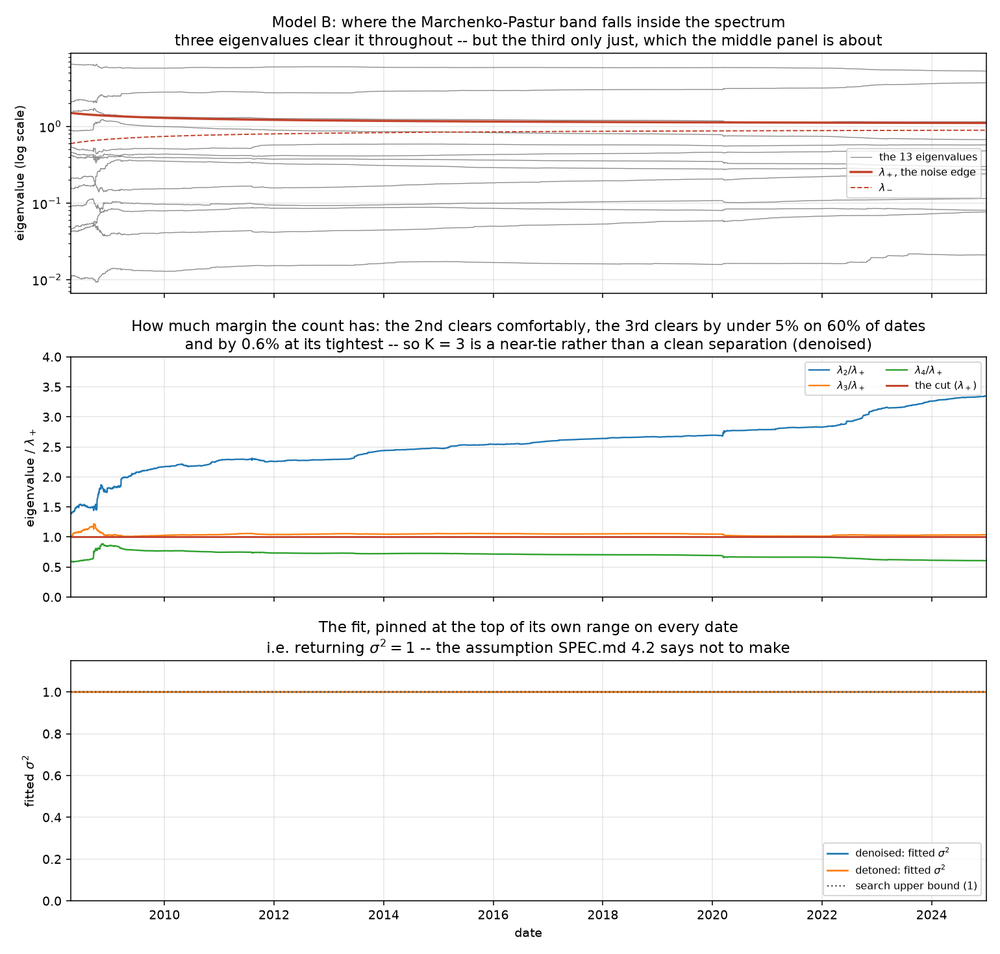

# Model B -- the statistical factor model

**Generated by `python -m mafrm.factors.statistical_report`. Do not edit by hand.**
SPEC.md 4.2, as ruled in 4.2.1-4.2.5. Built 2026-09-02 at commit `d09e49e65a59`.

## What was estimated

- **N = 13 assets**, not SPEC.md 4.2's 15. The frozen universe has 14 lines and `dollar` is a FRED index level rather than a tradable total return, so it is outside the investable set. SPEC.md 4.2.2 rules the 15 and the "expect 3-5 to survive" that goes with it **void rather than adjustable**.
- **T from 252 to 4,421** trading days, expanding, 2008-04-15 to 2024-12-31.
- **N/T from 0.0516 down to 0.0029.** This is the Marchenko-Pastur parameter and the same ratio the project's headline result is stated in; it is carried into `reports/stage_k_dependence.md` and W8-P1 from here.
- The correlation is the **equally-weighted sample correlation on an expanding window**, never the EWMA one. SPEC.md 4.2.1.
- Burn-in 252 days, **read from `factors.macro.rates.pca.expanding_min_window`** rather than declared again. SPEC.md 4.2.1's second half explains why that reuse is permitted inside `factors/` and why the same move into `risk/` is not.

## The finding: the `sigma^2` fit does not identify at this `N/T`

SPEC.md 4.2 says to fit `sigma^2` to the empirical eigenvalue spectrum *"rather than assuming `sigma^2 = 1`"*. **On this panel the fit returns `sigma^2 = 1` on all 4,170 dates** -- it converges to the upper bound of its own derived range, to within the optimizer's tolerance. The procedure SPEC.md 4.2 specifies returns the assumption SPEC.md 4.2 tells you not to make, and not because the data says so.

The mechanism is arithmetic and is measured in `experiments.md` rows 119-120 and 122. The objective is the squared error between a Gaussian KDE of the eigenvalues and the Marchenko-Pastur density, both on a grid spanning the candidate band. The MP density carries unit mass over a band of width `4 sigma^2 sqrt(N/T)`, so its **height** is of order `1/(4 sqrt(N/T))` -- about 4.6 at the full window. The KDE of 13 eigenvalues spread over a range of about 5 has a height of order 0.2. They differ by more than an order of magnitude everywhere on the band, so the objective is dominated by the theoretical density's own magnitude and is **monotone decreasing in `sigma^2`**: the fit minimises it by making the band as wide as it is allowed to be.

The consequence is exact and checkable: `lambda_+` equals `(1 + sqrt(N/T))^2` to 8.76e-06 on every date. The fitted `sigma^2` contributes nothing.

**This is the seventh number in this project written for a configuration it turned out not to be in** (SPEC.md 4.2.2 counts the sixth as this section's own "15x15, expect 3-5"), after the 0.15 correlation bar, the 0.3 comparand bar, zero-PSD-firings, the lambda curve's 1.5->0.95, and Aug 2007. Lopez de Prado's ch. 2 examples run at `N/T ~ 0.1`, where the band is wide and the kernel resolves it; row 122 confirms the same code identifies `sigma^2` there. Here `N/T = 0.0029` and the band is 0.22 wide -- narrower than the 0.15 kernel that is supposed to resolve it.

**The shipped configuration is unchanged.** `kde_bandwidth` is still SPEC.md 4.2's 0.15. Row 120 swept it from 0.01 to 1.00 as a control and the surviving factor count is 3 at every value, so the mis-specified constant is not load-bearing for anything Model B is. Row 120's prediction that `sigma^2` would pin at *every* bandwidth is **refuted** -- it leaves the bound at 0.01 -- and that refutation is recorded rather than the prediction being softened.

## The re-derived survivor expectation, and why it is not evidence

SPEC.md 4.2's "expect 3-5 to survive for a 15-asset sleeve" is void, so the expectation has to be re-derived at the actual `N` and `T`. With `sigma^2` pinned at 1, `lambda_+ = (1 + sqrt(N/T))^2`, which runs from 1.5058 at the 252-day minimum down to 1.1114 at the full window -- a collar of +11.1% around 1 at the right edge. A correlation matrix has trace `N`, so the average eigenvalue is exactly 1 and the band is a narrow ring around the average. The count is therefore set by how far the panel's real structure separates from 1, not by the noise band.

**This derivation was written after the count was known and is an explanation, not a prediction.** `experiments.md` records why: the first survivor count was seen while diagnosing what looked like a bug in the `sigma^2` fit and turned out not to be one. A pre-registered band would have been evidence; this is not, and it is labelled so.

## What Model B actually is

### denoised

`K` = 3 to 3 (median 3); **K = 3 on 4,170 dates**.

Loadings on the last date of the window (2024-12-31), in standardised units:

| asset | pc1 | pc2 | pc3 |
|---|---|---|---|
| us_large_equity | -0.337 | 0.273 | -0.136 |
| us_small_equity | -0.320 | 0.261 | -0.139 |
| dev_ex_us_equity | -0.328 | 0.289 | -0.032 |
| em_equity | -0.320 | 0.268 | 0.008 |
| govt_2y | 0.289 | 0.243 | 0.046 |
| govt_5y | 0.334 | 0.291 | -0.010 |
| govt_10y | 0.343 | 0.286 | -0.068 |
| govt_30y | 0.311 | 0.221 | -0.109 |
| tips_10y | 0.250 | 0.339 | 0.031 |
| ig_credit | 0.096 | 0.379 | -0.210 |
| hy_credit | -0.226 | 0.308 | -0.212 |
| commodity | -0.204 | 0.178 | 0.542 |
| gold | 0.032 | 0.206 | 0.747 |

### detoned

`K` = 2 to 3 (median 3); **K = 2 on 27 dates**, **K = 3 on 4,143 dates**.

Loadings on the last date of the window (2024-12-31), in standardised units:

| asset | pc1 | pc2 | pc3 |
|---|---|---|---|
| us_large_equity | 0.329 | -0.183 | 0.101 |
| us_small_equity | 0.297 | -0.185 | 0.151 |
| dev_ex_us_equity | 0.330 | -0.002 | 0.039 |
| em_equity | 0.297 | 0.033 | -0.067 |
| govt_2y | 0.245 | 0.214 | 0.624 |
| govt_5y | 0.341 | 0.091 | 0.317 |
| govt_10y | 0.349 | -0.093 | -0.138 |
| govt_30y | 0.238 | -0.250 | -0.533 |
| tips_10y | 0.296 | 0.083 | -0.140 |
| ig_credit | 0.263 | -0.132 | -0.216 |
| hy_credit | 0.249 | -0.128 | -0.007 |
| commodity | 0.125 | 0.628 | -0.247 |
| gold | 0.129 | 0.608 | -0.201 |

**`K = 3` is a threshold crossing, the margin behind it is thin, and the count should not be read as settled.** The second eigenvalue clears `lambda_+` comfortably -- never by less than 38% -- but the **third clears it by under 5% on 59.8% of dates and by 0.6% at its tightest** (2009-06-02). The fourth never comes within 5% of the cut from below, so the count is stable in the sense that it does not flicker; it is *not* stable in the sense of a clean separation, and a reader should not take "K = 3 on every date" as evidence of one. For the detoned variant the third eigenvalue crosses **below** `lambda_+` outright on 27 dates and the fourth comes within 5% of the cut on 46.5% of them, which is the near-tie showing up as an actual change in the count.

**A factor count that a marginal change in the estimate would flip is not a robust count**, and this one has the same cause as everything else in this report: when the noise band is 0.22 wide the cut is close to arbitrary, and a count produced by an arbitrary cut is arbitrary too. It is reported as a near-tie rather than as a settled `K = 3`.

This was measured while redrawing the figure, after the counts were known, and is logged as not pre-registered (`experiments.md` row 128). It also sharpens why the comparand table below comes out as it does: denoising at this `N/T` is making a knife-edge call about a component whose eigenvalue sits on the boundary, and then flattening everything below it.

The two variants are **not** the same model minus a component. In this panel the largest eigenvector is not a market factor -- it is equities against government bonds, the risk-on/risk-off opposition, and the all-positive common-level mode is the *second* eigenvector. SPEC.md 4.2 specifies detoning by **position** ("the first eigenvector") and justifies it by **identity** ("the 'market'"), and in a multi-asset sleeve those are different objects. Detoning here removes the opposition and promotes the market mode to first, which is why the detoned model is a different three-factor set rather than a truncated one. SPEC.md 4.2.4.

## Component identity, and where it breaks

An eigenvector's sign is arbitrary, so each date's loadings are oriented against the previous date's (SPEC.md 4.2.3). **The flip counts below are path-dependent and are not a defect rate**: `eigh`'s sign is deterministic for a given matrix but is not continuous in it, so one genuine discontinuity leaves the convention negated relative to LAPACK's for every date after it, and the count then measures how long the two have been out of step rather than how often anything went wrong. The statistic that can actually go wrong is the alignment after orientation, restricted to the SURVIVING components -- the noise block's eigenvalues are equal after denoising, so its directions are near-arbitrary and swap constantly, and including them would report a permanent instability in a subspace no factor is taken from:

| variant | disagreements with `eigh` | alignment: median | alignment: min | dates below 0.9 | rescale moves `K` |
|---|---|---|---|---|---|
| denoised | 20,856 | 1.0000 | 0.8290 | 1 of 4,170 | 0 of 4,170 |
| detoned | 28,223 | 1.0000 | 0.7712 | 4 of 4,170 | 528 of 4,170 |

The low-alignment dates are **eigenvalue crossings**: two adjacent eigenvalues swap order and the components swap identity with them. A sign convention cannot fix that and must not hide it, so it is measured and left visible. The factor series has a genuine discontinuity on those dates and any reading of a single date's loadings near one of them is a reading of two different components.

**The last column is why the factors are extracted from the PRE-rescale eigenvectors.** The unit-diagonal rescale that turns a denoised matrix back into a correlation matrix is not cosmetic: it turns the leading directions by up to `1 - |cos| = 0.10` and moves the survivor count across `lambda_+` on the dates counted there. Constant-average replacement itself rotates nothing -- it changes `Lambda` and leaves `V` alone -- so **denoising in the form SPEC.md 4.2 specifies is purely a rule for how many components to keep**, and taking the count from one spectrum while taking the directions from another would be neither faithful nor self-consistent. The rescaled matrix is still what the comparand table below uses, where a correlation matrix is what is needed.

## The SPEC.md 15.2 acceptance

Model B's factors through the `mafrm.risk` pipeline. `experiments.md` row 125.

**Row 125's falsifier fired, and this is the honest version of that.** It registered that *any* change under `src/mafrm/risk/` needed to accept a statistical factor set is the SPEC.md 15.2 early warning. One was needed: Model B's detoned panel drove SPEC.md 5.2's Bartlett correction to a non-positive variance at `T = 7..10`, and the remedy -- pre-registered four sessions earlier as `experiments.md` row 100 -- lives in `src/mafrm/risk/covariance.py`. **The trigger was a true positive; the inference "therefore an architecture problem" was not**, because a numerical fallback for a failure any factor set can provoke knows nothing about what the columns mean.

That was settled by **test rather than by argument**, because a gate waived once on a good argument is available later on a worse one. The change is permitted only because it passes the existing asset-class greps in `tests/test_risk_architecture.py` **and** a new test that exercises the fallback on a synthetic panel unrelated to either model and requires the firing columns and substituted values to be invariant under relabelling the columns. **The precedent is the sharper test, not the accepted exception.** SPEC.md 5.2.3 and `experiments.md` row 129.

With that one change, every combination below runs all five stages and comes back positive semi-definite. Nothing in `mafrm.risk` conditions on what its columns are, and `tests/test_risk_architecture.py` asserts that package cannot import from `mafrm.factors` at all.

| variant | horizon | `a` | K | stages run | min eigenvalue over all stages | cond | `lambda_F^2` | PSD |
|---|---|---|---|---|---|---|---|---|
| denoised | short | 1.0 | 3 | 5/5 | 6.599e-01 | 7.04 | 0.958089 | PASS |
| denoised | short | 1.4 | 3 | 5/5 | 6.594e-01 | 7.05 | 0.957876 | PASS |
| denoised | long | 1.0 | 3 | 5/5 | 7.029e-01 | 7.49 | 0.898565 | PASS |
| denoised | long | 1.4 | 3 | 5/5 | 7.023e-01 | 7.5 | 0.898337 | PASS |
| detoned | short | 1.0 | 3 | 5/5 | 4.483e-01 | 9.85 | 1.103462 | PASS |
| detoned | short | 1.4 | 3 | 5/5 | 4.483e-01 | 9.83 | 1.103227 | PASS |
| detoned | long | 1.0 | 3 | 5/5 | 6.214e-01 | 7.7 | 0.911985 | PASS |
| detoned | long | 1.4 | 3 | 5/5 | 6.229e-01 | 7.68 | 0.911754 | PASS |

**How often the Bartlett fallback fires** (`experiments.md` row 129). Date counts and contiguous episodes, never a rate -- these are expanding windows differing by one observation and are not independent draws (CLAUDE.md failure mode 9).

| variant | horizon | dates | contiguous episodes | window `T` |
|---|---|---|---|---|
| denoised | short | 0 of 4,170 | 0 | -- |
| denoised | long | 0 of 4,170 | 0 | -- |
| detoned | short | 2 of 4,143 | 2 | 7-9 |
| detoned | long | 3 of 4,143 | 2 | 7-10 |

## The comparands -- and what may not be done with them

SPEC.md 4.2 asks for Ledoit-Wolf as "the standard benchmark to beat" and OAS as a third point of comparison. **`sklearn.covariance.LedoitWolf` implements the IDENTITY target, not the constant-correlation target of Ledoit & Wolf (2004, JPM).** They are different estimators. The constant-correlation version is implemented by hand in `mafrm.factors.statistical.ledoit_wolf_constant_correlation` and is what the `ledoit_wolf` row below is; `oas` is Chen et al. (2010) Eq. 23, whose target is the scaled identity and is therefore the same family as sklearn's.

Every estimator's covariance is rebuilt as `diag(s) R diag(s)` from the **same** expanding-window standard deviations, so the comparison isolates the correlation estimator rather than confounding it with a volatility estimate. Minimum-variance weights are analytic and unconstrained -- no optimizer, no expected return, no costs -- rebalanced every 21 trading days.

| estimator | mean shrinkage intensity | condition number | Frobenius distance to sample | mean surviving K | min-var realised vol (%/yr) |
|---|---|---|---|---|---|
| `sample` | -- | 252 | 0.0117 | -- | 0.8964 |
| `mp_denoised` | -- | 20.7 | 0.8134 | 3.00 | 1.4088 |
| `mp_detoned` | -- | 23.3 | 5.9944 | 2.99 | 2.5355 |
| `ledoit_wolf` | 0.0101 | 210 | 0.0223 | -- | 0.9312 |
| `oas` | 0.0028 | 144 | 0.1345 | -- | 1.1726 |

**These are comparands, not candidates.** `experiments.md` row 126 pre-registered, before any of these numbers existed, that a comparand winning on any metric is a reported finding and **not** a licence to change Model B. SPEC.md 4.2 names MP-denoised PCA as Model B and nothing here selects between estimators, which is why these rows are `data-diagnostic` and the deflated-Sharpe trial count does not move. **Standing note: a later session that selects one of these on measured performance owes the `model-config` row.**

## What that table is a finding ABOUT

**It is a result about the method's regime, not about Model B being a bad model, and reading it the second way would be reading it wrong.** Marchenko-Pastur denoising is a high-dimensional technique. It exists to separate signal from sampling noise in a correlation matrix that has too many parameters for its sample, and its whole value is proportional to how much such noise there is.

At `N/T = 0.0029` there is essentially none. Thirteen series estimated from about 4,470 observations give a sample correlation that is already well determined; `lambda_+` sits at 1.11, the noise band is 0.22 wide, and there is almost nothing inside it to separate. **So denoising cannot help, and it hurts, because averaging ten eigenvalues that were never noise destroys real structure** -- precisely the small-eigenvalue directions a minimum-variance portfolio is built from. 1.41% against 0.90% is that sentence measured. The `N/T = 0.4` control flipping the sign to -6.1% is the confirmation, and it is why this is a statement about the regime rather than about the implementation or about Model B.

**This is the fourth published technique in this project whose value turns out to depend on `N` or `K`, and the first that is actively harmful rather than merely inert on a small panel.** SPEC.md 5.2's PSD repair is a no-op here; SPEC.md 5.3's parabola smoothing has three residual degrees of freedom and smooths almost nothing; SPEC.md 5.2's Newey-West correction pays variance to estimate lag terms that are zero in expectation. Those three cost little. This one takes a well-estimated matrix and makes it worse. `reports/stage_k_dependence.md` carries all four together, and the distinction is the point of putting them there.

**The week-7 test is registered now, before the equity panel exists.** That module runs about 500 names against the same history, so its `N/T` is about 0.11 -- in regime, and between the 0.0029 measured here and the 0.4 of the control. **Registered prediction: MP-denoising outperforms the sample covariance there.** Falsified if it fails to, in which case the regime explanation above is wrong and the underperformance measured here needs another cause -- SPEC.md 4.2.7 would be withdrawn rather than qualified. Registered while the direction is measured at two points either side and the panel it predicts does not exist, which is the only thing that makes a prediction like this worth anything. `experiments.md`, registered-not-counted.

Per-date diagnostics: `statistical_diagnostics.csv`.
