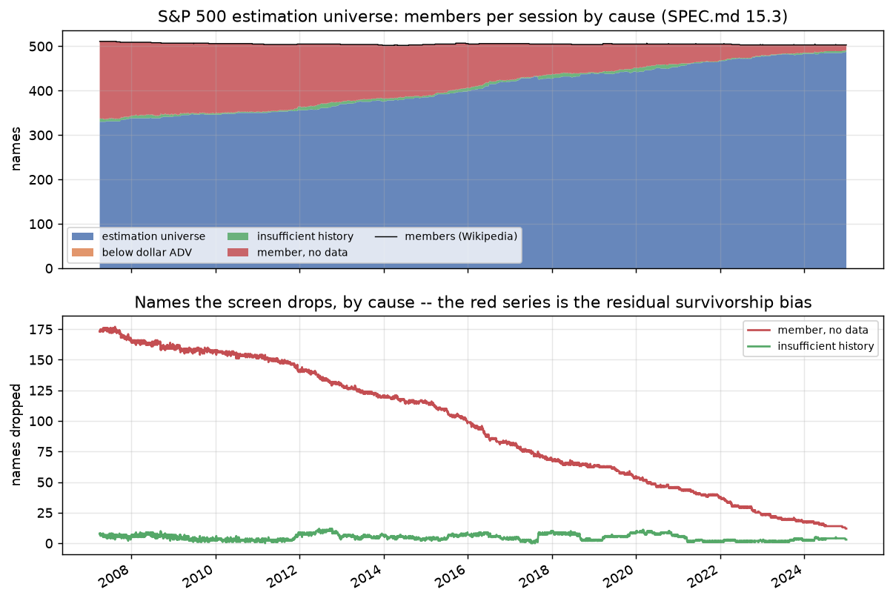

# The equity estimation universe -- SPEC.md 15.3

Generated by `python -m mafrm.factors.universe_report`. Rulings at SPEC.md 15.3.1;
experiments.md rows 261-268.

## What this is, and is not

An **approximate point-in-time S&P 500 membership**, reconstructed by walking
Wikipedia's changes table backwards from its current constituent list. It is a
genuine attempt at survivorship control and **not a solution**: the changes table is
incomplete, every addition or removal it omits is inherited by the walk, and the
per-year table below counts what is known to be missing. **No selection procedure
this project did not run is claimed.** Delisted names vanish from Yahoo and no free
source restores them; the count of members without a bar, per session, is the
residual survivorship bias stated as a number rather than as a caveat (ruling 5).

## Provenance

- Constituents: https://en.wikipedia.org/wiki/List_of_S%26P_500_companies
- Changes: https://en.wikipedia.org/wiki/Historical_components_of_the_S%26P_500
- Snapshot 2026-09-05, pulled 2026-09-05T12:39:47Z; bars pull 2026-09-05T12:47:26Z.
- Licence of the committed tables: CC BY-SA 4.0 (https://creativecommons.org/licenses/by-sa/4.0/), as a
  derived work of Wikipedia text, separate from the repository's code licence.
- Committed: `data/reference/sp500_membership_intervals.csv` (878 spells, 858 tickers) and
  `data/reference/sp500_membership.csv` (12649 trading sessions x 858 tickers,
  1976-07-01 to 2026-09-04, DAILY; the pipeline reads
  month ends off it, ruling 4).
- The changes table reaches back to **1976-07-01**; membership before the
  first year with a plausible row count is what the walk carries, not what the index held.
- Rename links applied: 6 (PSKY<-NCC 1994-09-30, J<-JEC 2007-10-26, WTW<-WLTW 2016-01-05, CPAY<-FLT 2018-06-20, AMCR<-BMS 2019-06-07, ECHO<-SATS 2026-03-23).
- Current members whose `Date added` did not parse: 0.

## Known gaps, per year (SPEC.md 15.3.1 ruling 4)

Counts of rows and names, never rates. *Additions without a row* counts CURRENT
members whose `Date added` has no addition row -- a lower bound that cannot see a
name added and since removed. *Inconsistencies* are rows the walk could not apply:
an added ticker not in the running set, or a removed one already in it.

| Year | Changes rows | Additions without a row | Inconsistencies | Rename links |
|---|---|---|---|---|
| 1976-1996 | 3 | 61 | 2 | 1 |
| 1997 | 1 | 14 | 1 | 0 |
| 1998 | 3 | 11 | 3 | 0 |
| 1999 | 3 | 9 | 2 | 0 |
| 2000 | 7 | 7 | 0 | 0 |
| 2001 | 0 | 8 | 0 | 0 |
| 2002 | 0 | 12 | 0 | 0 |
| 2003 | 1 | 5 | 0 | 0 |
| 2004 | 0 | 6 | 0 | 0 |
| 2005 | 2 | 5 | 1 | 0 |
| 2006 | 1 | 9 | 0 | 0 |
| 2007 | 11 | 8 | 2 | 1 |
| 2008 | 8 | 16 | 2 | 0 |
| 2009 | 13 | 12 | 1 | 0 |
| 2010 | 11 | 8 | 1 | 0 |
| 2011 | 19 | 10 | 2 | 0 |
| 2012 | 18 | 9 | 1 | 0 |
| 2013 | 19 | 6 | 2 | 0 |
| 2014 | 16 | 1 | 2 | 0 |
| 2015 | 29 | 4 | 2 | 0 |
| 2016 | 30 | 5 | 1 | 1 |
| 2017 | 29 | 3 | 1 | 0 |
| 2018 | 23 | 0 | 1 | 1 |
| 2019 | 24 | 2 | 3 | 1 |
| 2020 | 20 | 1 | 0 | 0 |
| 2021 | 20 | 0 | 0 | 0 |
| 2022 | 22 | 0 | 0 | 0 |
| 2023 | 17 | 0 | 0 | 0 |
| 2024 | 21 | 1 | 0 | 0 |
| 2025 | 21 | 0 | 0 | 0 |
| 2026 | 15 | 0 | 0 | 1 |

## Coverage of the bars (rulings 5 and 6)

The loader records a status per requested ticker in `data/manifest.json`: `ok`
(bars came back), `empty` (Yahoo answered and has no history -- its chart endpoint
returned its explicit *no data found* payload), or `failed` (an exception, timeout
or HTTP error, retried once). Only `empty` becomes *member, no data*.

- Tickers requested (current plus every added or removed name): **876**: ok 684, empty 192, failed 0.
- **No ticker is still `failed` after the retry**, so every absence below is a provider answer, not a transport failure (ruling 6).
- **Departed names** (on the removed side, not current): 355; ok 176, empty 179 (**50.4%** of departed names have no Yahoo history), failed 0.
- Members with no valid bar on the session at 2007-04-02: **173** of 511; at 2024-12-31: 12 of 503.
- The same count in the lost attempt's MONTHLY definition (no valid bar anywhere in the calendar month) at 2007-04-30: 173; daily on that session: 174 (row 267).

## The screen

- History: **252 valid daily bars for the ticker in the trailing 252 sessions** (SPEC.md 15.3; ruling 2 -- history, not tenure in the index).
- Dollar ADV: **not applied: `equity_universe.min_dollar_adv` is null** -- no published threshold exists and none is invented (SPEC.md 15.3.1 ruling 1); the liquidity screen is the one S&P applied at every addition, and this project has no float data to re-apply it.
- Window: every trading session from 2007-04-02 to 2024-12-31, 4469 sessions, strictly before the holdout boundary 2025-01-01.

Members by cause at each December month end (the last traded session of the month;
the full daily series is in `reports/universe_screen.csv`):

| Date | Members | No data | Insufficient history | Below dollar ADV | Estimation universe |
|---|---|---|---|---|---|
| 2007-12-31 | 509 | 166 | 5 | 0 | 338 |
| 2008-12-31 | 507 | 159 | 6 | 0 | 342 |
| 2009-12-31 | 506 | 158 | 2 | 0 | 346 |
| 2010-12-31 | 505 | 153 | 2 | 0 | 350 |
| 2011-12-30 | 505 | 140 | 9 | 0 | 356 |
| 2012-12-31 | 504 | 130 | 4 | 0 | 370 |
| 2013-12-31 | 502 | 119 | 7 | 0 | 376 |
| 2014-12-31 | 504 | 115 | 4 | 0 | 385 |
| 2015-12-31 | 506 | 99 | 7 | 0 | 400 |
| 2016-12-30 | 506 | 82 | 4 | 0 | 420 |
| 2017-12-29 | 505 | 69 | 9 | 0 | 427 |
| 2018-12-31 | 504 | 62 | 3 | 0 | 439 |
| 2019-12-31 | 505 | 55 | 8 | 0 | 442 |
| 2020-12-31 | 505 | 46 | 5 | 0 | 454 |
| 2021-12-31 | 505 | 37 | 2 | 0 | 466 |
| 2022-12-30 | 503 | 24 | 1 | 0 | 478 |
| 2023-12-29 | 503 | 18 | 2 | 0 | 483 |
| 2024-12-31 | 503 | 12 | 3 | 0 | 488 |

Estimation universe over the window: min 330, max 488. Members without data: min 12, max 177.

**Row 268, NOT PRE-REGISTERED (measured):** insufficient history peaks at **12** on 2012-06-19: APTV, BMC, CBE, CPRI, GR, META, MPC, PSX, SW, TIE, TRIP, XYL. The lost attempt measured 11 at 2020-02-28 under its monthly construction; this is the daily figure, and the names
are listed so the reader can check each against its listing date rather than take
a mechanism on trust.

## The count band (experiments.md row 266)

Member count from the committed matrix on every session of 2007-04-01 to 2025-01-01: min 502, max 511, band [480, 520].

## Registered rows, scored

| Row | Leg | Verdict | Measured |
|---|---|---|---|
| 265 | (a) tickers still failed after the retry at most 0 | **HOLDS** | 0 failed of 876 requested |
| 265 | (b) empty count within 3 of the lost attempt's 217 names without bars | **REFUTED** | 192 empty, 684 ok: difference -25 |
| 266 | member count inside the band on every session of the sample | **HOLDS** | min 502 (2013-12-23), max 511 (2007-04-02) against [480, 520], 4469 sessions |
| 267 | daily minus monthly 'member, no data' at 2007-04-30 below 5 | **HOLDS** | daily 174, monthly 173, excess 1 |

