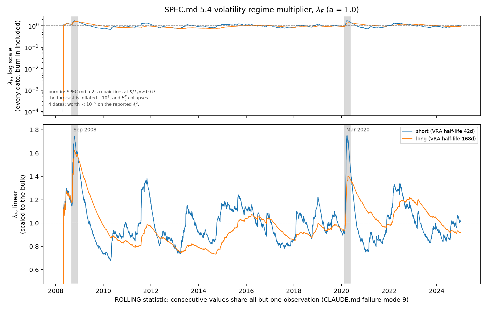

# Volatility regime adjustment (SPEC.md 5.4)

Generated by `python -m mafrm.factors.vra_report`. The bias series it reads are in
`vra_forecast_history.csv`, built at commit `d09e49e65a59` on
2026-09-02T17:07:51+00:00.

```
B_t^F      = sqrt( (1/K) sum_k (f_kt / sigma_kt)^2 )   sigma_kt made at t-1
lambda_F^2 = sum_t w_t (B_t^F)^2                       exponential w at tau_VRA
F         <- lambda_F^2 * F
```

Panel: 2008-04-14 to 2024-12-31, 4,139 forecast dates, minimum window 7 observations. Everything ends strictly before `sample.holdout_start` = 2025-01-01.

## The multiplier, over the whole history

| Variant | VRA half-life | `lambda_F^2` | `lambda_F` | vol effect | max `B_t^F` |
|---|---|---|---|---|---|
| short, a = 1.0 | 42d | 1.032665 | 1.016201 | +1.62% | 5.243 |
| short, a = 1.4 | 42d | 1.032466 | 1.016103 | +1.61% | 5.243 |
| short, eigenfactor OFF | 42d | 1.033150 | 1.016440 | +1.64% | 5.242 |
| long, a = 1.0 | 168d | 0.847180 | 0.920424 | -7.96% | 5.627 |
| long, a = 1.4 | 168d | 0.847062 | 0.920360 | -7.96% | 5.627 |
| long, eigenfactor OFF | 168d | 0.847461 | 0.920577 | -7.94% | 5.626 |

**Nothing is clipped.** SPEC.md 6.1 clips standardized returns at +-4 before taking a standard deviation; SPEC.md 5.4 specifies no clip and none is applied (CLAUDE.md invariant 9). The maximum single-day `B_t^F` is in the table above so a reader can judge how much of the multiplier one day carries.

## The overlap with the eigenfactor stage

`lambda_F^2` with SPEC.md 5.3's stage on and with it off. The VRA corrects for REGIME and the eigenfactor stage corrects for SAMPLING ERROR, which are different objects -- but the VRA is fitted to realised data, so it absorbs any systematic level bias including the one the eigenfactor stage exists to remove. The difference below is the size of that absorption.

| Horizon | `a` | on | off | off - on | as vol |
|---|---|---|---|---|---|
| short | 1.0 | 1.032665 | 1.033150 | +0.000485 | +0.023% |
| short | 1.4 | 1.032466 | 1.033150 | +0.000684 | +0.033% |
| long | 1.0 | 0.847180 | 0.847461 | +0.000282 | +0.017% |
| long | 1.4 | 0.847062 | 0.847461 | +0.000399 | +0.024% |

## Episodes



SPEC.md 5.4 names three episodes a working VRA must respond to. Two are on this panel and are shaded in the figure:

- **Sep 2008, short**: `lambda_F` peaks at 1.746 (from 1.155 entering the window), +51.1%.
- **Sep 2008, long**: `lambda_F` peaks at 1.622 (from 1.183 entering the window), +37.1%.
- **Mar 2020, short**: `lambda_F` peaks at 1.757 (from 0.912 entering the window), +92.6%.
- **Mar 2020, long**: `lambda_F` peaks at 1.400 (from 0.936 entering the window), +49.6%.

**Aug 2007 is NOT reachable on this panel and no claim is made about it.** The complete orthogonalized macro factor panel begins 2008-04-14, bound by `credit` (first valid 2008-04-14) and `rates_slope` (2008-04-02) through the 252-observation expanding-window orthogonalization burn-in off `sample.start` = 2007-04-01 -- a documented consequence of W2-P2's row 69. The Aug 2007 window (2007-08-01 to 2007-09-30) sits entirely before the first date this model can forecast. Stating the exclusion is the point: a chart that quietly began after the window it claimed to cover would read as a pass.

## Reading the chart

`lambda_F` here is a **rolling statistic** -- element `t` is the exponentially weighted mean of `B^2` over every forecast date up to `t`, so consecutive values share all but one observation and the series is enormously autocorrelated (CLAUDE.md failure mode 9). Its wiggles are not independent readings and **no count of its points is quoted as an `n`** anywhere in this report.

## The burn-in, which is in the figure rather than hidden

At the first four forecast dates -- **2008-04-23 to 2008-04-28**, where `K/T_eff` runs from **0.857 down to 0.667** -- the forecast volatility is inflated by about **four orders of magnitude**, so `B_t^F` is ~1e-4 and the rolling multiplier starts near zero. Traced stage by stage, the EWMA, Newey-West and PSD-repair outputs are all sane; **the eigenfactor stage produces it**, and only on the dates where SPEC.md 5.2's repair has fired. The repair floors a near-zero eigenvalue of `rho_hat` at 1e-14, SPEC.md 5.3's Monte Carlo then measures an enormous `lambda(k)` for a direction with essentially no variance, and the parabola fit spreads that through all six `gamma(k)` -- which is why every factor inflates rather than one. Two corrections that each pass their own check, compounding in sequence: CLAUDE.md failure mode 7. SPEC.md 5.4.4 carries the full record.

**It is worth at most 1.1e-9 on every `lambda_F^2` in the table above**, because a 2008 date carries weight 1.5e-31 (short) or 6.4e-10 (long) in an exponentially weighted sum ending in 2024. It is **not** fixed here: the fix is a burn-in, there is no published bound on `K/T_eff`, and inventing one would be CLAUDE.md invariant 9 (SPEC.md 5.4.1). What it gives W4 is a second, measured argument for the bound SPEC.md 5.1.2 pre-committed to -- with a located mechanism and a known reach.

## What is NOT here

SPEC.md 5.4's **specific-risk multiplier** -- a notional-weighted cross-sectional bias statistic across assets at the same `tau_VRA`. It needs specific returns, which SPEC.md 5.5 has not built. It is absent rather than stubbed. The shared half-life already sits at `volatility_regime_adjustment.halflife`, in its own top-level section precisely so the two legs cannot drift apart, so the session that writes SPEC.md 5.5 reads the same key and adds no parameter.
